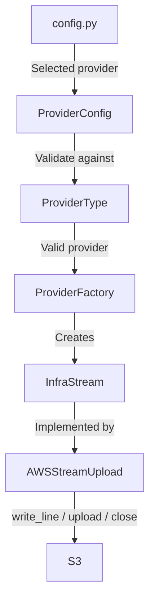

# breezeai-cog

Python code-ontology generator — parses source repositories into the **capture NDJSON contract**
consumed by the Breeze backend (Neo4j graph + embeddings) and MCP.

Python reimplementation of `breezeai-code-ontology-generator`.

## Documentation

- **[User Guide](docs/USER_GUIDE.md)** — install, CLI usage, output format, configuration, and the HTTP service.
- **[Developer Guide](docs/DEVELOPER_GUIDE.md)** — setup, project layout, and how it works.
- **[Extending Capture](skills/extend-capture/SKILL.md)** — add a new language, framework, or cross-cutting detector (start here); reliability-first discipline.
- **[Parser Reference](docs/parser-reference.md)** — the mechanical step-by-step for building a parser.

## Supported languages & frameworks

`breezeai-cog capabilities` prints the authoritative, live list. Snapshot:

| Language | Extensions | Framework / detector support |
|---|---|---|
| TypeScript / JavaScript | `.ts .tsx .mts .cts .js .jsx .mjs .cjs` | NestJS (& routing-controllers), Angular, Express, React, Vue, Next.js (App + Pages Router API routes), LoopBack, GraphQL (schema-first + code-first + an in-house resolver framework, server + client ops); AWS SNS/SQS/EventBridge/Lambda/S3/SES/CloudFront/Kinesis/DynamoDB/API Gateway (additive); HubSpot/Chargebee/Salesforce SDKs (additive) |
| Python | `.py` | FastAPI |
| Java | `.java` | Spring Boot, JAX-RS, Vert.x |
| C# | `.cs .asmx .svc` | ASP.NET (MVC / Web API / Minimal API / Web Forms), WCF / ASMX (SOAP), .NET ServiceHost, GraphQL (graphql-dotnet) |
| VB.NET | `.vb` | ASP.NET |
| Kotlin | `.kt` | Ktor |
| C++ | `.cpp .cc .cxx .c++ .hpp .h .hh .hxx .inl .ipp` | — |
| Groovy † | `.groovy` | Vert.x |
| Structured JSON / data | `.json` (+ YAML/TOML config) | Whole-document capture as a TOON `structured_data` statement |
| Config | `package.json`, `tsconfig`, `Dockerfile`, `docker-compose`, `pom.xml`, `requirements.txt`, `build.gradle`, `.csproj` / `.vbproj` / `.sln`, `Makefile`, … | — |

† **Groovy is best-effort / second-tier.** It reliably captures the package / import /
class / interface / enum / trait / method / field skeleton, but the grammar
([dekobon-tree-sitter-groovy](https://pypi.org/project/dekobon-tree-sitter-groovy/)) degrades
on some expression bodies (named-argument commas, parenthesised enum constants) and does not
parse **nested type declarations** (a `class`/`enum` inside a class body). Degradation is
always to *missing* nodes, never wrong ones — the parser fabricates nothing it cannot verify.

## Layout

- `src/breezeai_cog/schemas/` — the capture contract as Pydantic v2 models
  (**source of truth**). The language-agnostic JSON Schema is generated on demand for
  cross-language consumers via `breezeai-cog schema` (`export_json_schema()`); `SCHEMA_VERSION = 2.0`.
- `core/`, `parsers/`, `emit/`, `services/`, `server/` — the scanner, parser registry, multiprocess
  pipeline, NDJSON/S3 sinks, and the FastAPI service (`/api/analyze[-diff|-sql|-es]`).

## Develop

```bash
uv sync --extra all      # runtime + server extras + dev tools
uv run pytest            # test
uv run ruff check . && uv run mypy
```

See the [Developer Guide](docs/DEVELOPER_GUIDE.md) for the project layout and how to add a parser.

## InfraStream Provider Abstraction

The **InfraStream Provider Abstraction** provides a common interface for streaming data to cloud-based storage services without exposing provider-specific implementations to the application.

The application uses the generic `InfraStream` interface, while `ProviderFactory` selects the provider-specific implementation based on the configured cloud provider.

### Components

- **Provider Configuration** – Resolves the active cloud provider.
- **Provider Type** – Defines supported cloud providers.
- **Provider Factory** – Creates the provider-specific stream implementation.
- **Generic Interface** – `InfraStream` defines the common streaming contract.
- **Provider Implementation** – Implements provider-specific streaming and storage operations.

### Structure

```text
infra/
├── interface.py          # InfraStream
├── provider.py           # open_stream()
├── provider_type.py      # ProviderType
├── provider_config.py    # ProviderConfig
├── factory.py             # ProviderFactory
└── aws/
    └── s3.py              # AWSStreamUpload + S3 client/reconnect logic

```

### Adding a New Infra Provider

To add a new infra provider to the InfraStream Provider Abstraction:

1. **Add the provider type**
   - Add the new provider to the `ProviderType` Enum class in `provider_type.py`.

2. **Update the configuration**
   - Add the new provider name to the `Literal` in `config.py`.
   - Example, if you want to add Azure:
     ```python
     infra_provider: Literal["aws", "azure"] = "azure"
     ```

3. **Create the provider package**
   - Create a new folder under `infra/` for the provider.
   - Add the provider-specific storage/stream implementation.
   - Implement the `InfraStream` interface.
   - Implement the required stream operations, including `write_line()` and `close()`.
   - Implement `upload()` if the provider supports explicit upload operations.
   - Keep provider-specific SDK usage, client initialization, authentication, configuration, and connection handling inside the provider package.

4. **Update `ProviderFactory`**
   - Add the provider to the `create_stream()` method.
   - Example:
     ```python
     case ProviderType.AZURE:
         return AzureStreamUpload(key, settings)
     ```

5. **Keep application code provider-agnostic**
   - Application code should continue to use the generic `open_stream()` interface:
     ```python
     stream = provider.open_stream(key, settings)
     stream.write_line(data)
     stream.close()
     ```
   - Avoid directly instantiating provider-specific implementations such as `AWSStreamUpload` or `AzureStreamUpload`.

### Provider Selection Flow



### Provider Architecture
  ```mermaid
   classDiagram

    direction TB

    %% =========================
    %% Configuration
    %% =========================

    class ProviderType {
        <<enumeration>>
        AWS = "aws"
    }

    class ProviderConfig {
        -_provider: ProviderType
        +is_active: ProviderType
        +from_settings() ProviderConfig
    }

    ProviderConfig --> ProviderType : uses


    %% =========================
    %% Factory
    %% =========================

    class ProviderFactory {
        -provider: ProviderType
        +create_stream(key, settings) InfraStream
    }

    ProviderFactory --> ProviderType : uses
    ProviderFactory ..> InfraStream : creates


    %% =========================
    %% Infrastructure Interface
    %% =========================

    class InfraStream {
        <<interface>>
        +write_line(line: str) None
        +upload() None
        +close() str
    }


    %% =========================
    %% AWS Implementation
    %% =========================

    class AWSStreamUpload {
        -_bucket: str
        -_key: str
        -_settings: Settings
        -_client: Any
        -_reader: IO
        -_writer: IO
        -_gz: GzipFile
        -_error: BaseException
        -_thread: Thread
        +write_line(line: str) None
        +upload() None
        +close() str
        +execute_with_reconnect(operation) Any
        +_default_client(settings) Any
        +invalidate_client() None
    }


    %% =========================
    %% Interface Implementation
    %% =========================

    InfraStream <|.. AWSStreamUpload


    %% =========================
    %% Provider Facade
    %% =========================

    class provider.py {
        <<facade>>
        +open_stream(key, settings) InfraStream
    }

    provider.py --> ProviderConfig : uses
    provider.py --> ProviderFactory : initializes
    provider.py --> InfraStream : exposes
    ```
