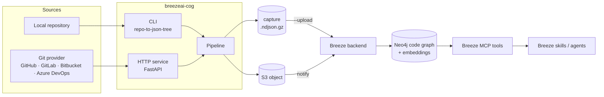
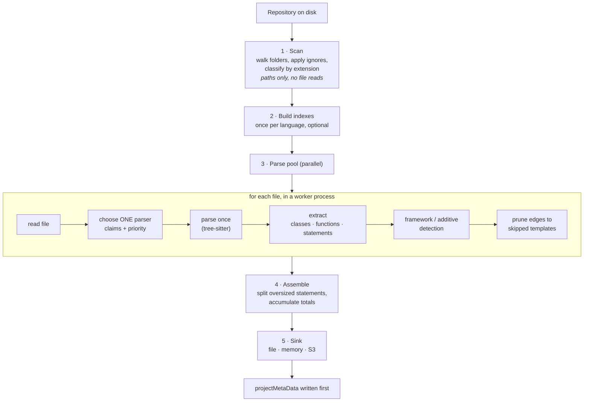
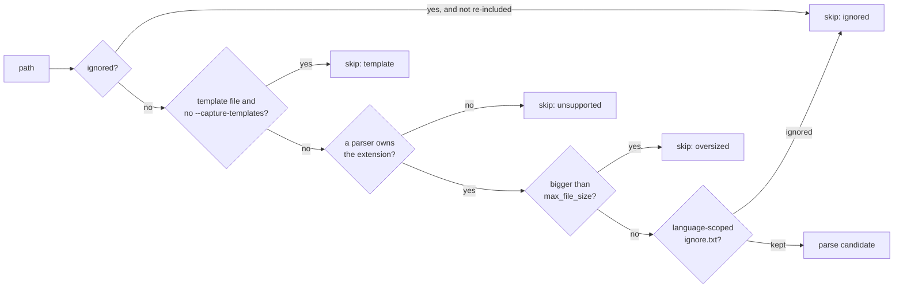
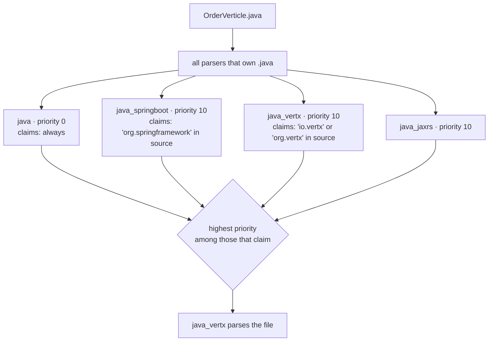
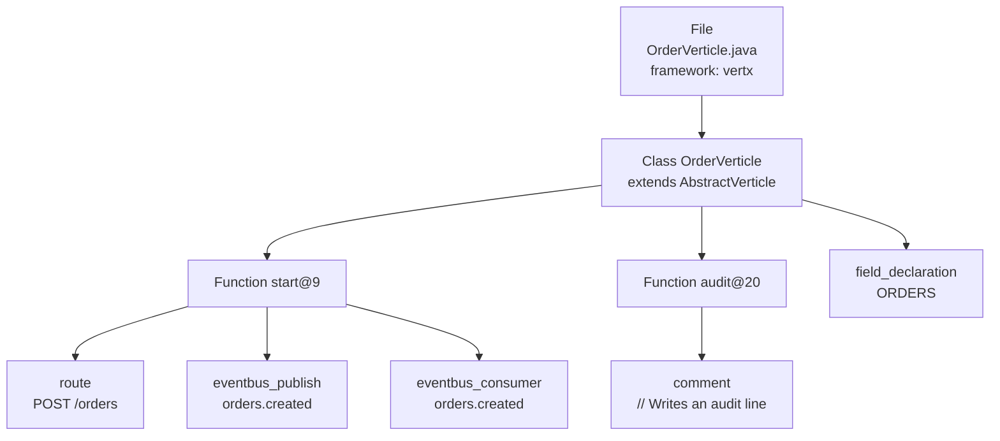
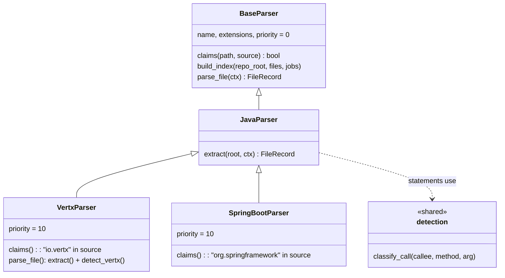
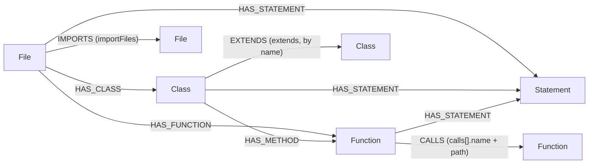
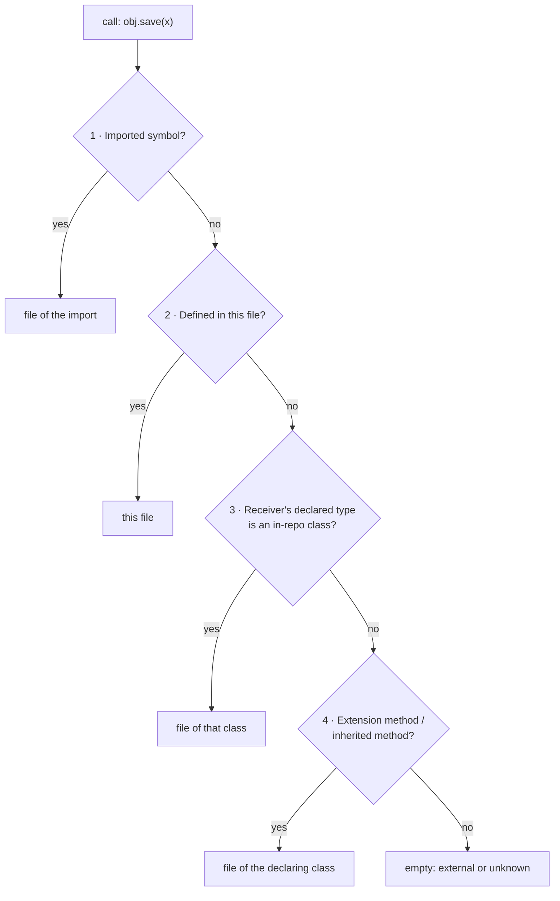
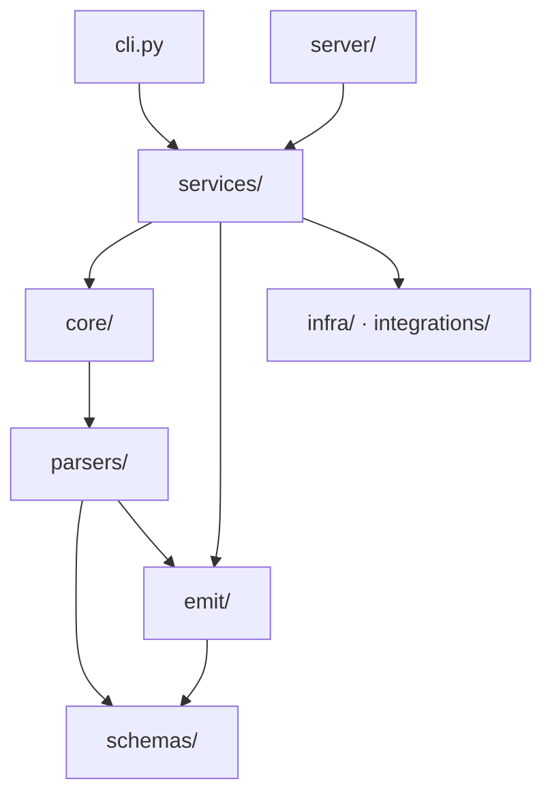

# breezeai-cog Architecture

This document explains how `breezeai-cog` (cog) turns a source repository into a code
ontology, and **why** it is built the way it is. It is written for people who want to
understand the system before changing it, reviewing it or building on it.

Every place where an architectural decision was made is marked with a callout like this:

> **Decision —** what was decided.
> **Why:** the reason. **Cost:** what we give up.

All decisions are also listed in [§17 Decisions at a glance](#17-decisions-at-a-glance). Where a
topic needs more detail than an overview, the section links to the page that covers it.

**Contents**

1. [What cog is (and is not)](#1-what-cog-is-and-is-not)
2. [System context](#2-system-context)
3. [Key concepts](#3-key-concepts)
4. [The pipeline, end to end](#4-the-pipeline-end-to-end)
5. [Worked example: one file, start to finish](#5-worked-example-one-file-start-to-finish)
6. [The parser model](#6-the-parser-model)
7. [The statement model](#7-the-statement-model)
8. [Ids and linking](#8-ids-and-linking)
9. [The capture contract and the graph](#9-the-capture-contract-and-the-graph)
10. [Cross-file resolution and honest-null](#10-cross-file-resolution-and-honest-null)
11. [Performance model](#11-performance-model)
12. [Config, data and non-code files](#12-config-data-and-non-code-files)
13. [Server mode](#13-server-mode)
14. [Failure handling and observability](#14-failure-handling-and-observability)
15. [Code layout and layering](#15-code-layout-and-layering)
16. [Known limitations and open questions](#16-known-limitations-and-open-questions)
17. [Decisions at a glance](#17-decisions-at-a-glance)
18. [Further reading](#18-further-reading)

---

## 1. What cog is (and is not)

cog reads a repository, parses every supported file with [tree-sitter](https://tree-sitter.github.io/),
and writes a **capture**: a gzipped NDJSON file with one line per source file, describing its
classes, functions, imports, calls and statements (routes, API calls, database access, events,
comments…). The Breeze backend loads the capture into a Neo4j **code graph**, which the Breeze
MCP tools and skills then query.

| cog does | cog does not |
|---|---|
| Read and parse source code | Run, compile or build the code |
| Describe what is in each file, and link files where the link is certain | Guess links it cannot prove |
| Produce a capture file, and optionally upload it | Build the Neo4j graph or the embeddings (the backend does that) |
| Work on one repository at a time | Link code *across* repositories |

> **Decision —** cog is a static, read-only analyser.
> **Why:** it runs on customer repositories without their build tools, dependencies or
> secrets, and must be safe to run anywhere. **Cost:** anything only known at runtime
> (dynamic routes, reflection, values from environment variables) is out of reach and is left
> empty rather than guessed.

> **Decision —** cog produces a file; the backend builds the graph.
> **Why:** the parser and the graph evolve at different speeds and in different languages
> (Python vs Node). A file contract between them lets each be released, tested and replayed
> on its own. **Cost:** every new field must be agreed on both sides ([§9](#9-the-capture-contract-and-the-graph)).

---

## 2. System context



There are four ways in. All of them run the same pipeline ([§4](#4-the-pipeline-end-to-end)).

| Entry point | Used by | Output |
|---|---|---|
| `breezeai-cog repo-to-json-tree` (CLI, incl. batch mode and `--upload`) | Developers, the `onboard-repository` skill | `.ndjson.gz` file, optionally uploaded to the backend |
| `breezeai-cog serve` (HTTP service) | The Breeze backend | Streamed to S3 and the backend is notified ([§13](#13-server-mode)) |
| `breezeai-cog capabilities` / `schema` | Tools and the backend | The live list of parsers, and the generated JSON Schema |
| Library (`iter_file_records`) | Python callers | `FileRecord` objects, one at a time |

Usage details are in the [User Guide](USER_GUIDE.md).

---

## 3. Key concepts

| Term | Meaning |
|---|---|
| **Capture** | The output: one `projectMetaData` line, then one `FileRecord` line per parsed file. |
| **`FileRecord`** | Everything cog knows about one file: its classes, functions, imports and a flat list of statements. |
| **`Class` / `Function`** | Declarations, linked to their owner by `parentId`. Methods are `Function`s whose parent is a `Class`. |
| **`Statement`** | One line-level unit inside a file, class or function: a declaration, a control-flow statement, a call, a comment. |
| **`nodeType`** | *What a statement is syntactically* — the tree-sitter node type, e.g. `expression_statement`. |
| **`semanticType`** | *What a statement means* — e.g. `route`, `api_call`, `eventbus_publish`. Empty for ordinary statements. |
| **`id` / `parentId`** | Deterministic identifiers that link every record to its owner ([§8](#8-ids-and-linking)). |
| **Language parser** | Parses one language (e.g. `java`). The fallback owner of the language's file extensions. |
| **Framework parser** | A language parser plus detection for one framework (e.g. `java_vertx`). Owns a file only when it **claims** it. |
| **Additive detector** | Detection for a cross-cutting library (ORM, HTTP client, messaging SDK) that runs inside whichever parser owns the file. |
| **`claims` / `priority`** | How a framework parser says "this file is mine", and how ties between parsers are broken ([§4.3](#43-choosing-one-parser-per-file)). |
| **Resolution index** | Optional repo-wide data a language builds once before parsing (e.g. Java fully-qualified class names → files). |
| **Honest-null** | The rule that a value cog cannot prove is left empty, never guessed ([§10](#10-cross-file-resolution-and-honest-null)). |
| **Template file** | Markup/view files (`.html`, `.vue`, `.cshtml`, `.aspx`…), skipped unless `--capture-templates` is given. |

---

## 4. The pipeline, end to end



| Stage | Code | Runs | Cost |
|---|---|---|---|
| 1. Scan | `core/scanner.py`, `core/ignore.py`, `core/pipeline.py` | Once, main process | One directory walk |
| 2. Build indexes | `BaseParser.build_index`, `pipeline._build_indexes` | Once per language, main process (may fan out) | Optional; usually one parse per file of that language |
| 3. Parse | `core/executor.py`, `core/registry.py`, `parsers/**` | Once per file, in parallel | One parse + a fixed number of tree walks |
| 4. Assemble | `pipeline._assemble`, `emit/split.py` | Streaming, main process | Linear in output |
| 5. Sink | `emit/sinks.py`, `emit/s3.py` | Streaming | Bounded memory |

### 4.1 Scanning and file selection

The scanner walks the repository and decides, **from the path alone**, which files to parse. It
never opens a file to make this decision. Each file ends up either as a parse candidate or in
one of four skip buckets.



Ignore rules come in layers. A path is kept when it is **included, or not ignored**.

| Layer | Source | When applied | Scope |
|---|---|---|---|
| Built-in | `core/default_ignores.txt` (`node_modules/`, `dist/`, `target/`, test files…) | During the walk — prunes whole folders | All languages |
| Repository | `.gitignore` / `.repoignore` in any folder | During the walk, relative to that folder | That subtree |
| Language | `parsers/<lang>/ignore.txt` | After the walk | Only files of that language |
| Include | `.repoinclude`, `parsers/<lang>/include.txt` | Overrides the ignores above | As above |

> **Decision —** the scan reads paths only.
> **Why:** a large repo can have hundreds of thousands of files; reading each one just to
> decide whether to parse it would double the I/O. **Cost:** a file is classified by its
> extension, so a file with an unusual extension is reported as `unsupported` even if its
> content is a known language.

> **Decision —** language ignore rules are applied after the walk, and only to files of that language.
> **Why:** a rule that makes sense for one language breaks another. C#'s NuGet `packages/`
> folder must not prune a TypeScript monorepo's `packages/` workspace. **Cost:** those
> folders are still walked; only universal rules can prune the walk.

> **Decision —** template (markup) files are skipped by default.
> **Why:** markup files are numerous and add little to the code graph; they flood search
> results. A parser declares which of its extensions are markup (`template_extensions`), so a
> parser that owns both code and markup (Vue, WebForms) keeps capturing the code half.
> **Cost:** UI structure in markup is only captured on request. See [Template Capture](template-capture.md).

Every skipped file is recorded with its reason in a `<repo>-skipped-report.json` sidecar, so a
reviewer can explain every skipped extension.

### 4.2 Repo-wide indexes

Some facts can't be known from one file. For example, which file defines
`com.acme.OrderService`? A language parser can provide `build_index`, which runs **once, before
parsing**, and returns data that every worker receives. Today it is used for things like Java
fully-qualified names and constants, TypeScript path aliases, and C#/VB class inheritance.

> **Decision —** cross-file data is built once in a separate pre-pass, not shared between workers while parsing.
> **Why:** workers then share no mutable state, so files can be parsed in any order, in
> parallel, with the same result every time. **Cost:** a language that needs an index reads
> its files twice (once to index, once to parse). The index must be picklable, and it is
> built per **language**, not per framework.

> **Decision —** an ambiguous index entry becomes empty, not "first one wins".
> **Why:** if two different files define the same simple name, resolving to either one would
> be a guess. **Cost:** some real links are not made.

Details: [`parser-reference.md` Step 6](parser-reference.md#step-6--build_index-only-if-cross-file-resolution-is-needed).

### 4.3 Choosing one parser per file

Several parsers can handle `.java` files: the Java parser, and the Spring Boot, JAX-RS and
Vert.x framework parsers. For each file, `core/registry.py::select` picks **exactly one**:



Rules:
- The language parser has priority 0 and claims everything, so every file has an owner.
- A framework parser claims a file with a **cheap content check** (a substring search).
- If a framework is built on another one, it gets a **higher** priority. NestJS (20) is built
  on Express (10), so a NestJS controller that also imports Express goes to NestJS.

> **Decision —** one parser per file; no combining of parsers.
> **Why:** each file is parsed once, and there is no question of merging two parsers'
> output for the same file. **Cost:** a file using two *unrelated* server frameworks only
> gets one framework's detection. Cross-cutting libraries are handled by additive detectors
> instead ([§6](#6-the-parser-model)), which do run alongside the owning parser.

> **Decision —** ownership is decided by a substring check, not by parsing.
> **Why:** it runs for every candidate parser on every file, so it must be nearly free.
> **Cost:** it can be fooled (a mention in a comment). Claims must be specific, and the
> [review guide](parser-review-guide.md#4-claims-does-the-framework-parser-own-the-right-files)
> checks for overlaps.

### 4.4 Parsing and extraction

The chosen parser parses the file **once** with tree-sitter (`parsers/treesitter.py::parse_source`)
and then extracts records from the tree.

Every parser is split into two methods:
- `parse_file(ctx)` — parses the source into a tree;
- `extract(root, ctx)` — builds the `FileRecord` from an already-parsed tree.

A framework parser calls the language parser's `extract` on its own tree and then adds its
detection. So the framework gets the full language extraction without parsing twice and without
copying code.

> **Decision —** tree-sitter for every language.
> **Why:** one fast, error-tolerant parsing technology for 15+ languages. It produces a tree
> even for code that doesn't compile, and it needs no toolchain. **Cost:** a syntax tree only,
> no type information, so type-dependent facts (which overload is called, the type of a
> variable from another file) are limited. Where a packaged grammar is unusable, a separate
> grammar is pinned (e.g. Groovy).

> **Decision —** every parse has a time limit (`BREEZEAI_COG_PARSE_TIMEOUT`, default 10 s).
> **Why:** a single pathological file (generated or minified code) must not stall the run. The
> limit is enforced inside tree-sitter, so it works on every OS. **Cost:** that file is
> recorded as failed and has no record.

### 4.5 Parallel execution

`core/executor.py` splits the files into batches (about four per worker) and runs them in a
process pool. Results are streamed back in completion order.

> **Decision —** processes (not threads), started with `spawn`.
> **Why:** parsing is CPU-bound, so threads would be limited by the Python GIL. `spawn`
> behaves the same on Linux, macOS and Windows, and avoids the deadlocks of `fork` in a
> multi-threaded process. **Cost:** pool start-up time, and everything passed to a worker
> must be picklable. The server's small `/api/analyze` requests therefore run in-process,
> with no pool.

> **Decision —** each file is isolated.
> **Why:** one bad file must not abort a repository. A parser exception or timeout is logged
> as `parse.file.failed` and the run continues. **Cost:** the failure is easy to miss.
> The run summary reports `failed` counts, and reviews check them.

### 4.6 Assembly and output

After parsing, every record passes through one place (`pipeline._assemble`) before it is written:

- **Template edges are pruned.** If an import or call points at a skipped template file, the
  link is removed (`calls[].path` becomes empty) so the graph has no edge to a missing node.
- **Oversized statements are split.** A statement whose text is longer than the limit is
  split into numbered parts (`…#part1of3`) instead of being truncated, so nothing is lost. Only
  the first part keeps the `semanticType`, so one route never becomes three routes.
- **Totals are accumulated** into `projectMetaData` (files, functions, classes, LOC, config summary).

The file sink writes records to a temporary file, then writes `projectMetaData` as the **first
line** followed by the records, gzipped. If nothing worth keeping was captured, no file is
written.

> **Decision —** NDJSON, streamed, metadata first.
> **Why:** a large capture never has to fit in memory, on either side, and the summary is at a
> fixed, cheap-to-read place. **Cost:** totals are only known at the end, so the body is buffered
> to a temporary file and copied once. (The backend's graph ingest skips this line and recomputes
> counts from the graph; the summary reaches it in the upload request instead — see
> [Capture-to-graph mapping](architecture/graph-mapping.md#7-projectmetadata).)

> **Decision —** size limits are applied in one place, at output time.
> **Why:** parsers always capture the full text, and every parser gets the same splitting
> behaviour without each one truncating differently.

---

## 5. Worked example: one file, start to finish

Input: `src/com/acme/OrderVerticle.java`

```java
package com.acme;

import io.vertx.core.AbstractVerticle;
import io.vertx.ext.web.Router;

public class OrderVerticle extends AbstractVerticle {
  static final String ORDERS = "orders.created";

  @Override
  public void start() {
    Router router = Router.router(vertx);
    router.post("/orders").handler(ctx -> {
      vertx.eventBus().publish(ORDERS, ctx.body().asJsonObject());
      ctx.response().end();
    });
    vertx.eventBus().consumer(ORDERS, msg -> audit(msg.body()));
  }

  // Writes an audit line
  private void audit(Object body) { }
}
```

**Step by step**

| Stage | What happens |
|---|---|
| Scan | `.java` is owned by the Java parser and the file is small → candidate, language `java`. |
| Index | The Java index records `com.acme.OrderVerticle` → this file, and the constant `ORDERS` → `"orders.created"`. |
| Select | `java_vertx` claims the file (`io.vertx` is in the source) and has priority 10 → it wins over `java` (0). |
| Parse | One tree-sitter parse with the `java` grammar. |
| Extract (Java) | 1 class, 2 methods, the imports, `calls[]` (with `audit` resolved to this file), and the structural statements. |
| Detect (Vert.x) | Finds the route, the publish and the consumer. Enriches the matching statements, and folds `ORDERS` to `"orders.created"`. |
| Comments | The comment above `audit` is bound to `audit` (the declaration that follows it). |

**What comes out** (abridged from a real run)



| `id` | `parentId` | `nodeType` | `semanticType` | Key fields |
|---|---|---|---|---|
| `…OrderVerticle.java:12:4` | `…#OrderVerticle#start@9` | `expression_statement` | `route` | `method: POST`, `endpoint: /orders`, `framework: vertx` |
| `…OrderVerticle.java:13:6` | `…#OrderVerticle#start@9` | `expression_statement` | `eventbus_publish` | `endpoint: orders.created` (folded from `ORDERS`) |
| `…OrderVerticle.java:16:4` | `…#OrderVerticle#start@9` | `expression_statement` | `eventbus_consumer` | `endpoint: orders.created` |
| `…OrderVerticle.java:19:2` | `…#OrderVerticle#audit@20` | `line_comment` | `comment` | — |

Things to notice:
- The publish on line 13 sits **inside a lambda**. Inside a method body the Java extractor
  walks into lambdas and gives their statements to the enclosing method (`start`), because a
  lambda is not a `Function`. The Vert.x detector then found the same line and **enriched** that
  statement with `semanticType`, `endpoint` and `framework`, instead of creating a second one.
- The id of `start` (`path#OrderVerticle#start@9`) is computed the same way by the Java parser
  and the Vert.x detector. That is why the detector's statements attach to the right parent
  ([§8](#8-ids-and-linking)).
- `importFiles` is empty because both imports are external. They are listed in `externalImports`.

---

## 6. The parser model

There are three ways to extend capture. Choosing the right one is the most important decision
when adding support for something new.

| You are adding… | Build a… | Owns the file? | Example |
|---|---|---|---|
| A new programming language | **Language parser** | Yes, as the fallback for its extensions | `parsers/java/` |
| A framework that defines how requests reach the code (routes, handlers) | **Framework parser** | Yes, when it claims the file | `parsers/java_vertx/` |
| A library used inside files owned by other frameworks (ORM, HTTP client, messaging SDK) | **Additive detector** | No, it runs inside the owning parser | `parsers/detection/` (classifiers), `parsers/additive.py` (registry), `parsers/typescript/aws_events.py` |



> **Decision —** framework parsers *subclass* their language parser.
> **Why:** the framework gets the full language extraction for free, with one parse and no
> copied code. **Cost:** a change to a language parser changes every framework built on it, so
> such changes get a stricter review ([review guide §1](parser-review-guide.md#1-scope-which-files-did-the-change-touch)).

> **Decision —** cross-cutting libraries are *additive*, never a one-per-file parser.
> **Why:** a controller that also publishes to a queue is still a controller. If the queue SDK
> were a parser, it would take the file away from the web framework and the routes would
> disappear. **Cost:** additive detectors run for every file of the language, so they must be
> cheap and guarded by a byte check.

> **Decision —** additive detectors self-register (`parsers/additive.py`); the language parser
> only calls `run_additive(<language>, …)` once.
> **Why:** adding a detector touches only its own module, not the language parser that every
> framework parser for that language inherits. The runner applies the shared rules (capture
> gate, fixture skip, byte guard, label only if unset) in one place. **Cost:** the detector list
> is no longer visible in `extract()` — `breezeai-cog capabilities` (`additiveDetectors`) and
> `tests/unit/test_additive.py` list it per language in run order. Run order is part of the
> output (new statement ids are disambiguated against the ones already on the record), so
> `order` is explicit and unique per language, and a reorder is a reviewed change.

> **Decision —** API, database and query detection is shared across languages (`parsers/detection/`).
> **Why:** "is `axios.get` an HTTP call?" has the same answer everywhere; one table, improved
> once, benefits every language. **Cost:** the shared rules must stay conservative so they
> don't produce false positives in any language.

How the shared classifiers and the additive detectors layer on top of the parser that owns
the file:

```
                        ┌──────────────────────────────────────┐
                        │  source file  (e.g. order.ctrl.ts)   │
                        └──────────────────┬───────────────────┘
                                           │
                                           ▼
                        ┌──────────────────────────────────────┐
                        │ registry.select(): exactly ONE owner │
                        │ highest-priority claims() wins       │
                        └──────────────────┬───────────────────┘
                                           │
             ┌─────────────────────────────┼─────────────────────────────┐
             ▼                             ▼                             ▼
  ┌─────────────────────┐       ┌─────────────────────┐       ┌─────────────────────┐
  │ framework parser    │       │ framework parser    │       │ base lang parser    │
  │ nestjs/angular/...  │       │ aspnet/wcf/...      │       │ (priority 0)        │
  │  └─ subclasses ─┐   │       │  └─ subclasses ─┐   │       │                     │
  └─────────────────┼───┘       └─────────────────┼───┘       └──────────┬──────────┘
                    ▼                             ▼                      │
     ═══════════════════════════════════════════════════════════════════╪═══════════
      BASE LANGUAGE extract()  → classes · functions · statements        │
     ═══════════════════════════════════════════════════════════════════╪═══════════
             │                                                           │
             ▼                                                           ▼
  ┌──────────────────────────────────────────────────────────────────────────────────┐
  │ SHARED CLASSIFIERS  parsers/detection/   (every language, per call statement)    │
  │   classify_call ─┬─ match_api   → HTTP client calls   (axios, fetch, HttpClient) │
  │                  ├─ match_db    → ORM / DB calls      (EF, Prisma, JPA, AR)      │
  │                  └─ is_query    → inline SQL strings                             │
  └──────────────────────────────────────┬───────────────────────────────────────────┘
                                         │
                                         ▼   only if --capture-statements
  ┌──────────────────────────────────────────────────────────────────────────────────┐
  │ ADDITIVE DETECTORS   base extract() ends with run_additive(<language>, …)        │
  │   registry: parsers/additive.py; each detector registers itself in its own       │
  │   module and is found by discovery; no parser edit to add one                    │
  │   runner: capture gate · skip_fixtures · optional byte guard · run by `order`    │
  │                                                                                  │
  │  typescript    order  detector         code in                    [skips tests]  │
  │                  10   express          typescript_express/routes.py      ✔       │
  │                  20   aws-events       typescript/aws_events.py                  │
  │                  30   sdk-calls        detection/sdk_calls.py                    │
  │                  40   graphql-client   typescript_graphql/routes.py      ✔       │
  │                  50   vue-routes       typescript_vue/routes.py          ✔       │
  │                                                                                  │
  │  csharp          10   lambda-handlers  csharp/lambda_events.py           ✔       │
  │                  20   lucene           csharp/lucene.py                          │
  │                                                                                  │
  │  scala           10   akka-events      scala/events.py                           │
  │                  20   spark            scala/spark.py                            │
  │                                                                                  │
  │  Java · Kotlin · Groovy · Python · PHP · Ruby · VB · C++ · HCL                   │
  │   └─ no additive hook yet: shared classifiers only                               │
  └──────────────────────────────────────┬───────────────────────────────────────────┘
                                         │
              each detector, per match:  ▼
              ┌──────────────────────────────────────────────────────┐
              │ call inside an existing, unclassified Statement?     │
              └──────────┬─────────────────────────────┬─────────────┘
                     yes │                             │ no
                         ▼                             ▼
          ┌────────────────────────────┐   ┌────────────────────────────┐
          │ ENRICH in place            │   │ APPEND new Statement       │
          │ semanticType · framework   │   │ (disambiguated id,         │
          │ method · endpoint          │   │  parent = owning function) │
          └─────────────┬──────────────┘   └─────────────┬──────────────┘
                        └───────────────┬────────────────┘
                                        ▼
              ┌──────────────────────────────────────────────────────┐
              │ FileRecord                                           │
              │ framework = owner's label, KEPT                      │
              │ (a detector sets it only if it is still None)        │
              └──────────────────────────────────────────────────────┘
```

For example, `order.controller.ts` imports both `@nestjs/common` and `@aws-sdk/client-sqs`:

```
 select()            → nestjs parser owns the file
 base extract()      → class OrderController, fn create, Statement@L11 "await this.sqs.send(...)"
   run_additive()      (still inside extract)
     express         → guard ✗ → skip
     aws-events      → guard ✓ → ENRICH Statement@L11 → framework=aws-sqs, endpoint=ORDER_QUEUE
     sdk-calls       → guard ✗ → skip
 nestjs detection    → + Statement  POST /orders   (after extract returns)
 ─────────────────────────────────────────────────────────────────────────────
 FileRecord.framework = "nestjs"   (route ✔  +  queue publish ✔)
```

Framework detection follows one of four patterns:

| Pattern | When | Example |
|---|---|---|
| **Off the record** | The signal is an annotation the language parser already captured. Reads the `FileRecord`; no extra tree walk. | Spring `@GetMapping` |
| **AST walk** | The signal is a call, not an annotation. | Vert.x `router.post(...)` |
| **Hybrid** | Both annotations and calls. | ASP.NET controllers + minimal APIs |
| **Embedded language** | Routes/queries live in a string of another language; that string is parsed with a second grammar. | GraphQL SDL in a template literal |

> **Decision —** detection that emits routes skips fixture files (stories, mocks, test harnesses).
> **Why:** those files create throwaway routers, and their routes are not the application's.
> **Cost:** the file is still captured for structure; only its routes are dropped.

How to build each kind: [Extending Capture](../skills/extend-capture/SKILL.md) (what to build
and the reliability rules) and [Parser Reference](parser-reference.md) (step by step).

---

## 7. The statement model

Statements are where most of the meaning lives, and where most design choices were made.

**Two independent types.** Every statement has a `nodeType` (its syntax, always present) and may
have a `semanticType` (its meaning, only when detected):

| Source | `nodeType` | `semanticType` |
|---|---|---|
| `if (x) { … }` | `if_statement` | — |
| `router.post("/orders")…` | `expression_statement` | `route` |
| `repo.save(order);` | `expression_statement` | `db_method_call` |
| `// Writes an audit line` | `line_comment` | `comment` |
| `@GetMapping("/x")` on a method (no statement node exists) | `synthetic` | `route` |

The `semanticType` values fall into two families:

| Family | Values |
|---|---|
| **Behaviour** — something the code *does* | `route`, `api_call`, `db_method_call`, `query_statement`, `eventbus_send`, `eventbus_publish`, `eventbus_consumer`, `verticle_deploy`, `service_proxy`, `timer`, `graphql_entity`, `iac_resource`, `iac_data`, `iac_module`, `iac_variable_value` |
| **Marker** — something the code *is* | `comment`, `enum_member`, `data_model`, `structured_data` |

The full list, with comments explaining each, is in `src/breezeai_cog/schemas/enums.py`.

> **Decision —** statements are flat on the `FileRecord`, linked by `parentId`, not nested inside functions.
> **Why:** a flat list is simple to stream, to split, and to load into the graph as
> `HAS_STATEMENT` edges. Detectors can append to it without rebuilding a tree. **Cost:** nesting
> is expressed only by line ranges and `parentId`.

> **Decision —** syntax and meaning are separate fields.
> **Why:** `nodeType` stays honest (it is always the real grammar node, or `synthetic` when there
> isn't one), while `semanticType` gives one cross-language filter ("all routes", "all enum
> members") that a grammar-specific `nodeType` cannot. **Cost:** consumers must look at both.

**Which statements are emitted.** Each language lists in its `mappings.py` the node types that
become statements (`EMIT_TYPES`: declarations, control flow, jumps). It also lists the scopes
(`NESTED_SCOPES`: nested classes, methods, lambdas…) that are extracted as their own
`Class`/`Function`. At file and class level the extractor stops at those scopes. Inside a function
body it walks into inline lambdas and gives their statements to the function, as in the
[worked example](#5-worked-example-one-file-start-to-finish).

**Enrich or append.** A detector that matches a call first looks for an existing statement on
the same span:
- if there is one, it **enriches** it (sets `semanticType`, `method`, `endpoint`…);
- if there is none (e.g. a call in a lambda that is a field initialiser, outside any
  function body), it **appends** a new statement.

This keeps one statement per piece of source, and avoids duplicates.

**Cross-cutting passes.** Comments are captured by one shared whole-file pass
(`parsers/comments_common.py`) for every language. The pass binds each comment to the
declaration that follows it, or else to the scope that contains it. Enum members are emitted as
statements under their enum class.

> **Decision —** all statements are gated by `ctx.capture_statements` (on by default; off with `--no-capture-statements`).
> **Why:** statements are the largest part of a capture. Some uses only need structure (files,
> classes, functions, imports), and turning statements off makes a capture much smaller and
> faster. **Cost:** with the flag off there are no routes, API/DB calls, events, comments or enum
> members either. Every detector must check the flag; reviews check this.

Detail page: [Statement model](architecture/statement-model.md).

---

## 8. Ids and linking

Every record gets an id from the helpers in `emit/ids.py`:

| Record | Id format | Example |
|---|---|---|
| File | `path` | `src/com/acme/OrderVerticle.java` |
| Class | `path#Class` (nested: `path#Outer.Inner`) | `…OrderVerticle.java#OrderVerticle` |
| Function | `path#[Class#]name@startLine` | `…#OrderVerticle#start@9` |
| Statement | `path:startLine:startCol` | `…OrderVerticle.java:12:4` |
| Statement part | `…#part{i}of{n}` | `…:12:4#part1of3` |

If two records would get the same id, `disambiguate` adds `#2`, `#3`… in a fixed order.

> **Decision —** ids are deterministic and computed from the source, never random or counters.
> **Why:** (1) a framework detector can compute the *same* parent id the language parser
> assigned, without a lookup; (2) re-running cog on unchanged code produces the same ids. The
> backend stores each `Class`/`Function`/`Statement` id as the `captureId` property and uses it
> to match parents and children, so a stable id means a stable graph. **Cost:** ids change when
> code moves to a different line.

---

## 9. The capture contract and the graph

The Pydantic models in `src/breezeai_cog/schemas/capture.py` **are** the contract. The JSON
Schema for other consumers is generated from them (`breezeai-cog schema`) and is never edited
by hand.

How the capture becomes a graph (built by the backend):



| Capture field | Becomes |
|---|---|
| `parentId` | Containment edges: `HAS_CLASS`, `HAS_FUNCTION`, `HAS_METHOD`, `HAS_STATEMENT` |
| `importFiles` | `IMPORTS` edges between files |
| `calls[]` | `CALLS` edges to the functions named `calls[].name` in file `calls[].path` (no edge when `path` is empty) |
| `extends` | `EXTENDS` edges to classes with that name in the repository |
| `id` of Class / Function / Statement | The `captureId` property (the statement's unique key) |

> **Decision —** `File` and `Class` are **open** nodes; `Function` and `Statement` are **allow-listed**.
> **Why:** files and classes need room for parser-specific attributes (config metadata, UI
> roles). Functions and statements are the most numerous nodes, so their shape is kept fixed.
> **Cost:** a new field on `Function` or `Statement` is **silently dropped** at ingest unless the
> backend's allow-list is updated in the same change.

> **Decision —** fields a parser did not fill are left out of the output (`exclude_none`).
> **Why:** a missing field means "not known", which is different from an empty or false value,
> and it keeps lines small.

> **Decision —** the contract has a version (`SCHEMA_VERSION`), and a parser built for a different version refuses to register.
> **Why:** a parser can never emit a shape the rest of the system doesn't expect. **Cost:**
> the version is bumped by hand when the models change, so reviews of `schemas/` must check it.

> **Decision —** new values reuse the existing vocabulary where possible.
> **Why:** a new `semanticType` value is cheap (the backend stores it as-is). A new node type,
> edge type or restricted field is a change across services and needs a decision first
> ([Extending Capture §5](../skills/extend-capture/SKILL.md#5-choosing-how-to-store-what-you-capture)).

The external description of the graph model is the
[Code Ontology Parser Target Spec](https://accionlabs.atlassian.net/wiki/spaces/~5cfa0cffd898610dbf3bacf1/pages/2483453956/Code+Ontology+Parser+Target+Spec+Neo4j+Graph+Model).
Detail page: [Capture-to-graph mapping](architecture/graph-mapping.md).

---

## 10. Cross-file resolution and honest-null

cog links things across files in three ways: imports (`importFiles`), calls (`calls[].path`) and
inheritance (`extends`). All three follow the same rule:

> **Decision —** honest-null: resolve only when certain; otherwise leave it empty.
> **Why:** the graph is read by agents that act on it. A missing edge is a known gap; a wrong
> edge is a confident lie that sends an agent to the wrong code. **Cost:** lower recall. Some
> real links are missing.

Call targets are resolved by `parsers/callresolve.py`, trying each step in order and stopping at
the first certain answer:



Other places that resolve values:
- **Constant folding** (`parsers/constfold.py`): a route path or event address written as a
  constant is replaced by its value, but only for true compile-time constants (e.g. Java
  `static final String`). A runtime value stays unresolved.
- **Inheritance** (`parsers/index_common.py`): base classes in other files, e.g. routes
  inherited from a base controller.

Detail page: [Cross-file resolution](architecture/cross-file-resolution.md).

---

## 11. Performance model

cog has to handle very large repositories, so its cost per file is deliberately fixed. These are
the rules every parser keeps:

| Rule | Why |
|---|---|
| The scan never reads file contents. | I/O grows with repo size; only candidates are read. |
| Each file is parsed **once** by the main grammar. Framework parsers reuse the tree via `extract`. | Parsing is the most expensive step. |
| Extraction does a **fixed** number of tree walks per file (e.g. imports, symbol tables, declarations, comments, framework detection), never one walk per item found. | Cost stays linear in file size; nested walks become quadratic on large files. |
| Additive detectors start with a cheap byte check (`b"…" in source`). | They run on every file of the language, and most files don't use the library. |
| A second grammar parses only the embedded fragment, with the same timeout. | Embedded languages (SQL, GraphQL) must not re-parse the whole file. |
| `build_index` runs once per language and fans out with `parallel_map`, honouring `--jobs`. | The pre-pass must not become a single-threaded bottleneck. |
| No state is shared between files. Per-file state is reset after each file. | Files can be processed in any order, in parallel. |
| Output is streamed. | Memory does not grow with repository size. |

> **Decision —** the pass budget is fixed by the architecture, not chosen per parser.
> **Why:** every parser then costs about the same per line of code, and a slow parser stands
> out in review. **Cost:** some detections need extra design work to fit into an existing walk.

How to check a change against these rules:
[review guide §6](parser-review-guide.md#6-performance-and-complexity).

---

## 12. Config, data and non-code files

Not everything in a repository is code. These are handled by dedicated parsers that produce the
same `FileRecord`, with `type: "config"`:

| Kind | Parser | What is captured |
|---|---|---|
| Project config (`package.json`, `pom.xml`, Dockerfile, compose, `.env`…) | `parsers/config/` | A summary in `FileRecord.metadata` (dependencies, build tool, ports…), rolled up into `projectMetaData.configs` |
| Data documents (JSON workflows, lookup tables) | `parsers/structured_json/` | The whole content as one `structured_data` statement |
| Infrastructure as code (Terraform / HCL) | `parsers/hcl_terraform/`, `parsers/terraform/` | `iac_*` statements with a cloud `platform` |
| Schema languages (Prisma, GraphQL SDL) | `parsers/prisma/`, `parsers/graphql/` | `data_model` / `graphql_entity` statements |

> **Decision —** `FileRecord.language` is the file *format* (`json`, `hcl`), and `framework` is the *tool* (`terraform`).
> **Why:** one grammar can serve several tools, and "what the file is" stays separate from "how it is used".

Database schemas (SQL DDL, Elasticsearch mappings, NoSQL collections) are handled differently:
`src/breezeai_cog/analyzers/` turns uploaded schema files into their own record types for the
backend's database ontology. These are **not** `FileRecord`s and are only used by the server.

> **Decision —** database schemas sit outside the code capture contract.
> **Why:** they describe a database, not a source file, and feed a different part of the
> graph. **Cost:** a second, smaller contract to keep in step with the backend.

---

## 13. Server mode

`breezeai-cog serve` runs a FastAPI service used by the Breeze backend, server to server, behind
the ingress.

| Endpoint | Purpose |
|---|---|
| `POST /api/analyze` | Analyse a small set of files sent in the request; returns JSON (in-process, no pool). |
| `POST /api/analyze-diff` | Clone or fetch a repository, analyse it (or only the changed files), stream the capture to S3 and notify the backend. |
| `POST /api/analyze-sql` · `-nosql` · `-es` | Database schema analysis ([§12](#12-config-data-and-non-code-files)). |
| `POST /api/git/*` | Git provider operations for the backend: latest commit, compare, tree, pull requests. |

> **Decision —** the first analysis clones the repository; later ones fetch only the changed files via the provider API.
> **Why:** a clone avoids per-file API rate limits on large repositories, and incremental
> fetches keep updates fast. **Cost:** two code paths to acquire sources.

> **Decision —** output is streamed straight to object storage, and the backend is notified only once the upload is complete.
> **Why:** the backend never reads a partly written file. Retries are left to the storage SDK,
> because a half-consumed stream cannot be replayed safely.

> **Decision —** storage and git providers sit behind interfaces (`infra/`, `integrations/scm/`).
> **Why:** adding a cloud or a git host doesn't touch the pipeline.

Details: [Developer Guide — object storage and git providers](DEVELOPER_GUIDE.md#object-storage-providers).

---

## 14. Failure handling and observability

| Situation | What happens | Where you see it |
|---|---|---|
| A file fails to parse or times out | It is skipped; the run continues | `parse.file.failed` in the log; `failed` count in the summary |
| A language's `build_index` fails | That language runs without an index (fewer links), never a crash | `build_index.failed` warning |
| A file is skipped by the scan | Recorded with its reason | `<repo>-skipped-report.json`, detail log |
| A statement is too large | Split into parts; if a parts cap is set and exceeded, the tail is dropped with a visible marker | `statement.parts_capped` warning |
| Nothing worth keeping is captured | No output file is written | Run summary |

Every run reconciles its counts: **scanned = parsed + failed + skipped**. A difference means
something was lost, and is worth investigating.

> **Decision —** fail per file, loudly, and keep going.
> **Why:** one bad file in a 50,000-file repository must not cost the whole capture, but the
> loss must be visible. **Cost:** a failed run can still look successful at a glance, so the
> summary and the review process check the counts.

---

## 15. Code layout and layering

```
src/breezeai_cog/
├─ cli.py, config.py, logging.py   entry point, settings, logging
├─ schemas/                        the capture contract (source of truth)
├─ core/                           scan, ignore, registry, pipeline, executor
├─ parsers/
│  ├─ base.py, treesitter.py       parser contract, bounded parsing
│  ├─ statements_common.py         shared statement emission
│  ├─ comments_common.py           shared comment pass
│  ├─ callresolve.py, constfold.py, index_common.py   shared resolution helpers
│  ├─ detection/                   shared api / db / query classifiers
│  ├─ vertx_common.py, dotnet_common.py, aspnet_common.py   helpers shared by one framework family
│  ├─ <lang>/                      language parsers
│  └─ <lang>_<framework>/          framework parsers
├─ emit/                           ids, NDJSON, gzip, sinks, statement splitting
├─ analyzers/                      database schema analysers (server only)
├─ services/                       use cases: analysis, upload, diff, notify
├─ server/                         FastAPI routes and git orchestration
├─ infra/                          object storage providers
└─ integrations/scm/               git providers
```



Dependencies point **one way**: entry points → services → core → parsers → schemas. Parsers
never import from `core/`, `services/` or `server/`. Code shared between framework parsers
should live in a shared module (like `vertx_common.py`) rather than one framework importing
from another.

**Change zones.** How much review a change needs depends on where it lands:

| Zone | Paths | Affects |
|---|---|---|
| **Parser-local** | `parsers/<lang>_<framework>/`, its test file | That parser only |
| **Language parser** | `parsers/<lang>/` | Every framework built on that language |
| **Shared family helper** | e.g. `parsers/vertx_common.py` | Every parser in that family |
| **Core** | `schemas/`, `core/`, `emit/`, `parsers/base.py`, `treesitter.py`, `statements_common.py`, `comments_common.py`, `callresolve.py`, `constfold.py`, `index_common.py`, `detection/`, `cli.py`, `config.py` | Every parser — an architectural change |

> **Decision —** parser-specific code stays in the parser's own directory.
> **Why:** a change can then only affect the files that parser owns, which keeps reviews small
> and other languages safe. See the [review guide](parser-review-guide.md).

---

## 16. Known limitations and open questions

| Topic | Limitation |
|---|---|
| Equal-priority claims | Two unrelated frameworks with the same priority can both claim a file (e.g. Spring Boot and Vert.x, both 10). The winner then depends on registration order, silently. |
| Runtime values | Routes or addresses built at runtime (from config, environment, reflection) stay empty. |
| Type information | tree-sitter has no type checker, so overloads and inferred types are only partly resolved. |
| One repository at a time | Links between repositories (a client in one repo calling a service in another) are not made by cog. |
| Ids and line numbers | Ids include line numbers, so moving code changes ids. |
| Grammar quality | Capture is only as good as the grammar. Some grammars are pinned to forks until upstream fixes land. |

---

## 17. Decisions at a glance

| Area | Decision | Section |
|---|---|---|
| Scope | Static, read-only analysis; nothing is executed | [§1](#1-what-cog-is-and-is-not) |
| Scope | cog writes a file; the backend builds the graph | [§1](#1-what-cog-is-and-is-not) |
| Scan | Classify by path only; never read files during the scan | [§4.1](#41-scanning-and-file-selection) |
| Scan | Language ignore rules are scoped to that language, after the walk | [§4.1](#41-scanning-and-file-selection) |
| Scan | Template (markup) files are off by default | [§4.1](#41-scanning-and-file-selection) |
| Index | Cross-file data is built once, before parsing; workers share nothing | [§4.2](#42-repo-wide-indexes) |
| Index | Ambiguous entries become empty | [§4.2](#42-repo-wide-indexes) |
| Selection | One parser per file, chosen by `claims` + `priority` | [§4.3](#43-choosing-one-parser-per-file) |
| Selection | Ownership is decided by a cheap substring check | [§4.3](#43-choosing-one-parser-per-file) |
| Parsing | tree-sitter for every language | [§4.4](#44-parsing-and-extraction) |
| Parsing | Every parse has a time limit | [§4.4](#44-parsing-and-extraction) |
| Execution | Process pool with `spawn` | [§4.5](#45-parallel-execution) |
| Execution | Failures are isolated per file | [§4.5](#45-parallel-execution) |
| Output | Streamed NDJSON, metadata first | [§4.6](#46-assembly-and-output) |
| Output | Size limits applied in one place, by splitting, not truncating | [§4.6](#46-assembly-and-output) |
| Parsers | Framework parsers subclass their language parser | [§6](#6-the-parser-model) |
| Parsers | Cross-cutting libraries are additive detectors | [§6](#6-the-parser-model) |
| Parsers | Additive detectors self-register; the language parser calls one runner | [§6](#6-the-parser-model) |
| Parsers | API / DB / query detection is shared across languages | [§6](#6-the-parser-model) |
| Parsers | Route emitters skip fixture files | [§6](#6-the-parser-model) |
| Statements | Flat list linked by `parentId` | [§7](#7-the-statement-model) |
| Statements | Syntax (`nodeType`) and meaning (`semanticType`) are separate | [§7](#7-the-statement-model) |
| Statements | All statements are gated by `capture_statements` | [§7](#7-the-statement-model) |
| Ids | Deterministic ids computed from the source | [§8](#8-ids-and-linking) |
| Contract | Open `File`/`Class`, allow-listed `Function`/`Statement` | [§9](#9-the-capture-contract-and-the-graph) |
| Contract | Unknown values are omitted | [§9](#9-the-capture-contract-and-the-graph) |
| Contract | Versioned contract; mismatched parsers refuse to register | [§9](#9-the-capture-contract-and-the-graph) |
| Contract | Reuse vocabulary; new node/edge types need a decision | [§9](#9-the-capture-contract-and-the-graph) |
| Resolution | Honest-null: resolve only when certain | [§10](#10-cross-file-resolution-and-honest-null) |
| Performance | A fixed pass budget for every parser | [§11](#11-performance-model) |
| Non-code | `language` = format, `framework` = tool | [§12](#12-config-data-and-non-code-files) |
| Non-code | Database schemas sit outside the code capture contract | [§12](#12-config-data-and-non-code-files) |
| Server | Clone first, then fetch changed files only | [§13](#13-server-mode) |
| Server | Stream to storage; notify only after a complete upload | [§13](#13-server-mode) |
| Server | Storage and git providers behind interfaces | [§13](#13-server-mode) |
| Failures | Fail per file, loudly, and keep going | [§14](#14-failure-handling-and-observability) |
| Layout | Parser-specific code stays in the parser's directory | [§15](#15-code-layout-and-layering) |

---

## 18. Further reading

| Page | Covers |
|---|---|
| [User Guide](USER_GUIDE.md) | Installing and running cog, options, output format |
| [Developer Guide](DEVELOPER_GUIDE.md) | Development setup, storage and git providers, testing |
| [Extending Capture](../skills/extend-capture/SKILL.md) | What kind of parser to build, and the reliability rules |
| [Parser Reference](parser-reference.md) | Building a parser step by step |
| [Parser Review & Gap Analysis Guide](parser-review-guide.md) | Reviewing a parser and reporting its gaps |
| [Template Capture](template-capture.md) | How markup files are handled |
| [Statement model](architecture/statement-model.md) | Emission rules, enrichment, comments, enum members, splitting |
| [Cross-file resolution](architecture/cross-file-resolution.md) | Indexes, call resolution, inheritance, constant folding |
| [Capture-to-graph mapping](architecture/graph-mapping.md) | How each capture field becomes a Neo4j node, property or edge |
| [Target Spec (Confluence)](https://accionlabs.atlassian.net/wiki/spaces/~5cfa0cffd898610dbf3bacf1/pages/2483453956/Code+Ontology+Parser+Target+Spec+Neo4j+Graph+Model) | The graph model the backend ingests |
</content>
</invoke>
