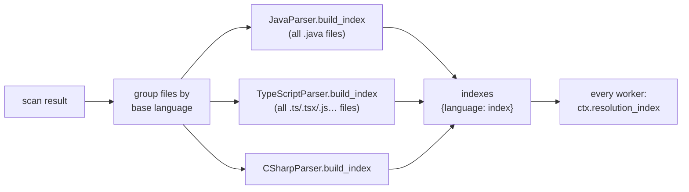
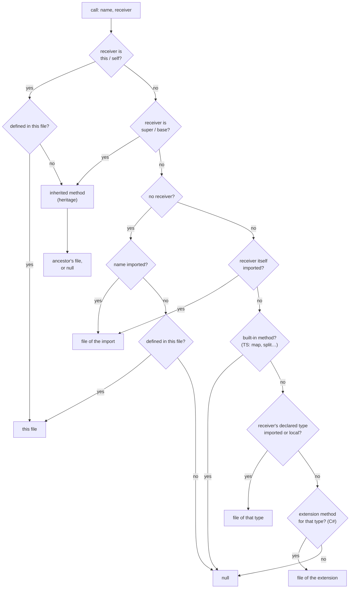
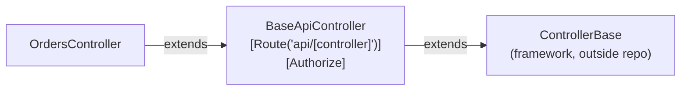
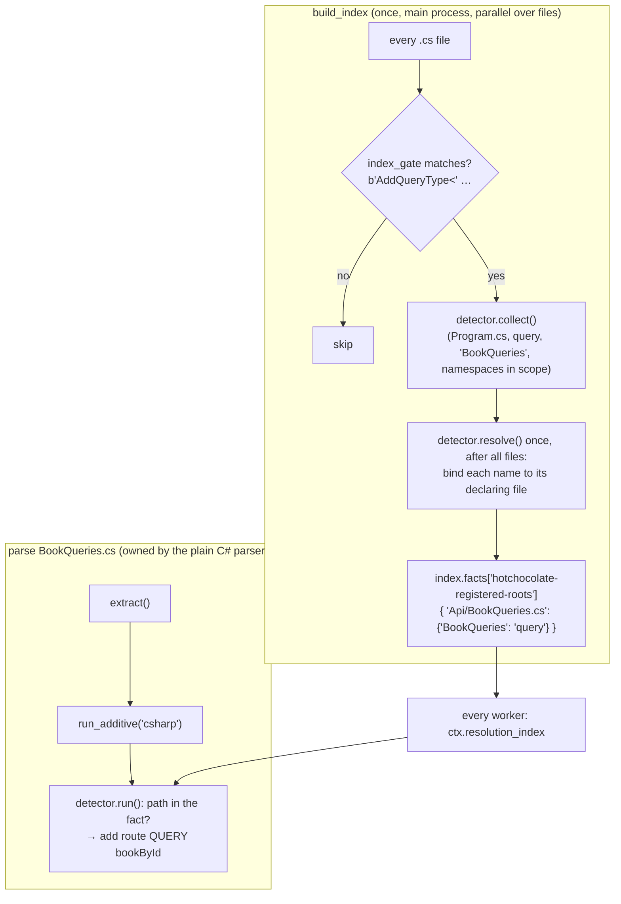

# Cross-File Resolution

A single file rarely tells the whole story: it imports other files, calls functions defined
elsewhere, extends classes from other modules, and uses constants declared in other places. This
page explains how cog links those references to real files, **and when it deliberately doesn't**.

It expands [§10 of the architecture doc](../architecture.md#10-cross-file-resolution-and-honest-null).
Paths below are relative to `src/breezeai_cog/`.

**Contents**

1. [The rule: honest-null](#1-the-rule-honest-null)
2. [What gets linked](#2-what-gets-linked)
3. [Repo-wide indexes (`build_index`)](#3-repo-wide-indexes-build_index)
4. [Import resolution](#4-import-resolution)
5. [Call resolution](#5-call-resolution)
6. [Inheritance (heritage)](#6-inheritance-heritage)
7. [Constant folding](#7-constant-folding)
8. [Cross-file route composition](#8-cross-file-route-composition)
9. [Links to skipped template files](#9-links-to-skipped-template-files)
10. [Known limitations](#10-known-limitations)
11. [Rules for parser authors](#11-rules-for-parser-authors)

---

## 1. The rule: honest-null

> **Decision —** resolve a reference only when the answer is certain. If there is no answer, or
> more than one possible answer, leave it empty (`null`).
> **Why:** the graph is read by agents that act on it. A missing link is a visible gap; a wrong
> link is a confident lie that sends an agent to the wrong code. **Cost:** fewer links
> (lower recall) in exchange for links that can be trusted (high precision).

The rule shows up in three places:
- **Indexes:** a name that maps to two different files becomes `None` in the index, so nothing
  resolves through it ([§3](#3-repo-wide-indexes-build_index)).
- **Resolvers:** a resolver returns the first certain answer, or `None`. It never picks one of
  several candidates.
- **Values:** a route path or event address is only filled in from a constant whose value the
  language guarantees at compile time ([§7](#7-constant-folding)).

---

## 2. What gets linked

| Capture field | Means | Resolved by | Graph edge |
|---|---|---|---|
| `importFiles[]` | Files this file imports | cog — each language's `imports.py` | `IMPORTS` |
| `externalImports[]` | Imports that are not (or can't be proven to be) in the repo | cog | — |
| `calls[].path` | The file that defines a called function | cog — `parsers/callresolve.py` | `CALLS` |
| `extends`, `implements` | Parent class / interfaces, **as written in the source** | **not resolved by cog**; the backend matches `extends` by class name | `EXTENDS` |
| `endpoint` on routes / events | Route path or event address | cog — constant folding | — |

`calls[].path` is always a **file path**, never a function id. The backend then links to the
functions with that name in that file ([graph mapping §5](graph-mapping.md#5-edges-and-how-their-targets-are-found)).

---

## 3. Repo-wide indexes (`build_index`)

Some questions can't be answered from one file. Which file defines `com.acme.OrderService`? What
is the value of `Topics.ORDERS`? Which class does `BaseController` extend? A language parser
answers these with an optional **index**, built once before parsing begins.



How it works (`core/pipeline.py::_build_indexes`):
- Files are grouped by their **base language** parser, and each language's `build_index` runs
  once, in the main process, over all its files.
- Large indexes are built in parallel with `parallel_map` (`parsers/index_common.py`), using the
  same `--jobs` as parsing.
- The result must be picklable. It is handed to every worker as `ctx.resolution_index`.
- **Framework parsers use their language's index.** A Spring or Vert.x file gets the Java index.
  The one exception: a framework parser that owns an extension no language parser owns (Vue's
  `.vue`, WebForms' `.aspx`) gets an index built over just those files.
- If an index build fails, a warning (`build_index.failed`) is logged and that language runs
  **without** an index: fewer links, never a crash.

What each index holds:

| Language | Holds | Used for |
|---|---|---|
| Java, Groovy | fully-qualified class name → file; `Class.FIELD` → constant value | imports, same-package types, event addresses / route paths |
| Kotlin, Scala | fully-qualified class name → file | imports, same-package types |
| C# | type → files; global `using`s; project roots (`.csproj`), their MSBuild `using`s and project references; class heritage incl. methods; extension methods; page routes; **facts from additive detectors' index stage** (`index.facts`) | type resolution, inherited calls, extension calls, routes |
| VB | class heritage (base class + attributes) | inherited controller routes |
| TypeScript / JavaScript | `tsconfig`/`jsconfig` path aliases (per config scope); constant values; class heritage; Angular and Express route mounts | aliased imports, inherited calls, route prefixes |
| C++ | header basename → file; free functions; `Class::method`; `Class::field` types; heritage | `#include`, calls |
| Ruby | ActiveRecord model names | recognising DB calls |
| HCL / Terraform | folder → `.tf` files | local `module` sources |
| HTML | template → owning component | linking templates to components |
| Python | *(no index)* | — |

> **Decision —** indexes are built once, before parsing, and are read-only afterwards.
> **Why:** workers share nothing, so files can be parsed in any order and in parallel, with the
> same result every time. **Cost:** a language with an index reads its files twice, and the
> index is per language, not per framework.

> **Decision —** a conflicting entry collapses to `None` (`index_common.record_distinct`).
> **Why:** if two files declare `Utils`, binding to either would be a guess. The rule is also
> order-independent, so the parallel build gives the same index every time. **Cost:** common
> names (`Utils`, `Constants`, `Base`) often don't resolve.

---

## 4. Import resolution

Every language's `extract_imports` returns four things:

| Output | Becomes |
|---|---|
| internal imports (proven repo paths) | `importFiles` → `IMPORTS` edges |
| external / unresolved imports | `externalImports` |
| exported names | `exports` |
| **bindings** (`local name → file`) | input to call resolution ([§5](#5-call-resolution)) |

How each language turns an import into a file:

| Language | How | Goes to `externalImports` |
|---|---|---|
| Java, Groovy, Kotlin | Look up the fully-qualified name in the index. Same-package classes are bound without an import. Groovy `as` aliases are bound. | wildcards, unknown or ambiguous names |
| Scala | As Java, plus selector groups `{A, B}`, renames `{A => B}` and relative package imports | wildcards, unknown names |
| C# | A `using` names a namespace, not a file. Each **type used** in the file is looked up under the namespaces in scope (own namespace and parents, `using`s, `global using`s). Bound only if exactly one file matches; on a tie, a file in the same `.csproj` wins. | every namespace `using`; unresolved static / alias targets |
| VB | Not resolved (`Imports` names namespaces) | every `Imports` |
| TypeScript / JavaScript | Relative paths from the file's folder; otherwise the nearest `tsconfig`/`jsconfig` path alias. Tries the exact file, `.js`→`.ts` rewrites, known extensions, then `index.*`. Re-exports and literal dynamic `import()` count too. | anything not found on disk |
| Python | `import a.b` / `from a.b import x` from the repo root; relative imports walk up folders. Tries `a/b.py`, then `a/b/__init__.py`. | anything not found |
| Ruby | Only `require_relative` | every `require`; unresolved `require_relative` |
| C++ | `#include "x.h"` looked up by file **basename** in the index | `<system>` includes; unknown or ambiguous basenames |

**Example — a TypeScript path alias**

`apps/web/tsconfig.json`:
```json
{ "compilerOptions": { "baseUrl": ".", "paths": { "@/*": ["src/*"] } } }
```
In `apps/web/src/pages/a.ts`:
```ts
import { api } from "@/lib/api";
```

| Step | Result |
|---|---|
| Nearest config scope that contains the file | `apps/web` |
| Alias match | `@/*` → `src/*`, rest = `lib/api` |
| Candidate | `apps/web/src/lib/api` |
| Try `.ts` | `apps/web/src/lib/api.ts` exists ✓ |
| Output | `importFiles: ["apps/web/src/lib/api.ts"]`, binding `api → apps/web/src/lib/api.ts` |

If neither `api.ts` nor `api/index.ts` existed, `@/lib/api` would go to `externalImports`.

> **Decision —** the nearest config scope wins.
> **Why:** in a monorepo, each package has its own aliases. Using another package's `@/` would
> link to the wrong file.

---

## 5. Call resolution

Each function's `calls[]` lists the names it calls. `parsers/callresolve.py` fills
`calls[].path` with the file that defines the callee, when that can be proven. Resolution stops
at the first certain answer:



**Example — resolving through the receiver's type** (TypeScript)

```ts
import { OrderRepo } from "./order.repo";

class OrdersService {
  constructor(private repo: OrderRepo) {}
  list() { this.repo.findAll(); }
}
```

| Input | Value |
|---|---|
| bindings | `OrderRepo → src/order.repo.ts` |
| declared types | `repo → OrderRepo` |
| call | `findAll`, receiver `this.repo` → variable `repo` → type `OrderRepo` |
| **result** | `calls: [{ name: "findAll", path: "src/order.repo.ts" }]` |

If the call were `this.items.map(...)`, `map` is a built-in array method, so `path` stays empty,
even if `items` has an in-repo type.

**Which languages use which steps:**

| Language | Imports + same file | Receiver type | Extension methods | Inherited methods |
|---|---|---|---|---|
| TypeScript / JavaScript | ✓ | ✓ (+ built-in guard) | — | ✓ |
| C# | ✓ (+ `using static`) | ✓ | ✓ | ✓ |
| Java, Kotlin, Groovy, Scala | ✓ | ✓ | — | — |
| Python | ✓ | — | — | — |
| VB, Ruby | same file only | — | — | — |
| C++ | own resolver (`cpp/index.py`): same file, `Class::method`, inherited, free functions, field types | | | |

> **Decision —** calls resolve to a file, not to a specific function.
> **Why:** cog can usually prove the file (from imports and types), but not the overload — that
> needs a type checker. The backend joins on name + file. **Cost:** an overloaded callee is
> linked to all its overloads.

---

## 6. Inheritance (heritage)

`extends` and `implements` are written into the capture **as they appear in the source** (simple,
qualified or generic). cog does not resolve them to files; the backend links `extends` to classes
of the same name ([graph mapping §10](graph-mapping.md#10-known-mismatches-between-cog-and-the-backend)).

Inside cog, a **heritage index** records each class's parent (by simple name), its
decorators/attributes and, where supported, its methods. It is used for two things:

| Use | Languages | Example |
|---|---|---|
| **Inherited calls** — `this.save()` where `save` is declared in a base class | TypeScript, C#, C++ | `calls[].path` → the base class's file |
| **Inherited route settings** — a controller's route prefix and auth come from its base class | ASP.NET (C#, VB); HotChocolate root types | `[Route("api/[controller]")]` and `[Authorize]` on `BaseApiController` apply to `OrdersController : BaseApiController` |

Walking the chain (`index_common.walk_heritage`) goes nearest ancestor first and stops at a
cycle, at a parent outside the repo, or at an ambiguous name.



For ASP.NET, a chain that ends at an unknown base (ambiguous, or outside the repo and not a known
framework base) marks the route prefix as **unknown**, not empty, so an incomplete route is never
reported as complete.

Merging rules for the index:
- **C# partial classes:** a part with no base defers to a part that names one; two different
  bases → `None`.
- **Same simple name in different namespaces:** merged if they share a base; otherwise `None`.
- **TypeScript:** a class name declared in two files → `None`.

---

## 7. Constant folding

Route paths and event addresses are often written as constants:

```java
public static final String ORDERS = "orders.created";
…
vertx.eventBus().publish(ORDERS, body);
```

cog replaces `ORDERS` with `"orders.created"` in `endpoint` — **only** when the language
guarantees the value at compile time.

| Expression | Result |
|---|---|
| `"orders.created"` | `orders.created` |
| `ORDERS` (a `static final String` with a literal value) | `orders.created` |
| `Topics.ORDERS` (constant in another file, via the index) | its value |
| `APP + "/created"` (constants and literals) | the joined value |
| `"/orders/" + id` (literal + runtime value) | `/orders/{id}` |
| `topicName` (a runtime variable) | empty |

How (`parsers/constfold.py`):
- An initialiser is turned into a list of tokens (literals and references). It is picklable, so
  the Java/Groovy index can carry constants from every file.
- `resolve_all` resolves constants that refer to other constants, in a bounded number of passes.
  If any reference is missing, the whole value stays empty (all or nothing).
- Mixed literal and runtime parts are joined with `{name}` placeholders.

Used by: the Java and Groovy indexes, and the Vert.x parsers (Java and Groovy). TypeScript has its
own constant map in its index (top-level `const`s, string enums, `static readonly`), used for
Angular, React and Express route paths.

**Guard for generated code:** very long `+` chains (generated HTML/JS builders, hundreds of
levels deep) would overflow Python's stack. Past `max_concat_depth` (default 100) cog leaves the
endpoint empty, keeps the statement, and logs one line per file.

> **Decision —** follow the language's own constant rules, not naming conventions.
> **Why:** a field named `URL` that isn't `final` can change at runtime; guessing its value would
> break honest-null. **Cost:** values from configuration files or environment variables stay empty.

---

## 8. Cross-file route composition

Some frameworks build a route from pieces in several files. These use the index too:

| Framework | Pieces | Source of the cross-file data |
|---|---|---|
| Express | `app.use("/api", router)` in one file + `router.get("/orders")` in another → `/api/orders` | TypeScript index: Express mounts |
| Angular | lazy-loaded child routes under a parent path | TypeScript index: route mounts |
| ASP.NET | base controller route prefix + action route | heritage ([§6](#6-inheritance-heritage)) |
| WebForms | `MapPageRoute` URL → `.aspx` page | C# index: page routes |
| HotChocolate | `AddQueryType<BookQueries>()` in `Program.cs` → `BookQueries.cs` is a query root | additive detector's index stage ([below](#a-framework-fact-from-another-file-the-additive-index-stage)) |
| Terraform | local `module` source → the `.tf` files it loads | HCL index |

### A framework fact from another file: the additive index stage

Sometimes a file is framework code only because **another** file says so. In HotChocolate
v11/v12, a plain class becomes a GraphQL root when the composition root registers it:

```csharp
// Api/Program.cs
builder.Services.AddGraphQLServer().AddQueryType<BookQueries>();

// Api/BookQueries.cs — nothing HotChocolate in this file
namespace Catalog { public class BookQueries { public Book GetBookById(int id) => …; } }
```

No `claims()` check can see this, and the HotChocolate parser never owns `BookQueries.cs`. The
**additive detector** registry handles it: a detector can add an optional *index stage* that
runs inside the language's `build_index`, next to its usual read-time `run`.



How a registered name is bound to a file uses the C# rules, so the binding is the one the compiler
would make:
- the namespaces in scope at the registering file: its own namespace and parents, its `using`s,
  `global using`s, and `<Using Include>` from its `.csproj` or a `Directory.Build.props` above it;
- a type in another project counts only if the registering project **references** it
  (`<ProjectReference>`, transitively). Two unrelated projects that reuse a namespace declare
  different types;
- a partial class binds all of its files; anything still ambiguous binds nothing.

| Case | Result |
|---|---|
| `Shop/Program.cs` and `Admin/Program.cs` each register their own `BookQueries` | each binds to its own project's class |
| An unregistered `Legacy.BookQueries` elsewhere | not a root |
| A class registered as a query in one composition root and a mutation in another | dropped |
| A root declared inside the registering file itself | not emitted from that file (it stays with its owner, e.g. `csharp-aspnet`, and keeps its REST routes); it still resolves by name for an `[ExtendObjectType(typeof(...))]` elsewhere |
| A file the HotChocolate parser owns | the parser emits from the same fact; the detector stays out (one shared ownership check) |

> **Decision —** cross-file framework facts use the additive detector registry's optional index
> stage, not a framework-specific field on the language index or a new selection hook.
> **Why:** one registry for framework add-ons, with the same discovery, validation and
> `capabilities` listing; the language index keeps only language rules; parser selection is
> unchanged, so no file can be taken from its owner. **Cost:** a detector that emits for files
> with no marker cannot use a byte guard — its first check is a dictionary lookup instead; and the
> framework's own parser must share an ownership check with the detector so the two never both emit.

---

## 9. Links to skipped template files

Resolvers check the filesystem, so they can resolve an import of a template file (e.g.
`./Avatar.vue`). When template files are skipped (the default), that file is never captured, and
the link would point at nothing. After each file is parsed, `core/executor.py::_prune_template_edges`:

- removes template paths from `importFiles`;
- sets `calls[].path` to empty for calls into a template (the call itself is kept).

> **Decision —** prune in one place after parsing, not in each resolver.
> **Why:** it covers every parser and every future markup type with one rule.

---

## 10. Known limitations

| Limitation | Effect |
|---|---|
| `extends` is not resolved by cog, and the backend matches it by exact name | Qualified or generic parents (`a.b.Base`, `Repo<T>`) get no `EXTENDS` edge; same-name classes all get one |
| C++ includes resolve by basename | Two `util.h` files in different folders → both unresolved |
| Python resolves absolute imports from the repo root only | `src/`-layout projects (package under `src/`) resolve poorly |
| Ruby `require_relative "x/y"` (no `./`) resolves from the repo root | It should resolve from the file's own folder |
| TypeScript heritage: any class name used in two files → `None` | Even identical duplicates block inherited-call resolution |
| Java, Kotlin, Groovy, Scala: no inherited-call resolution | `this.save()` from a base class has no `path` |
| VB: no import resolution and no inherited calls | Few `CALLS` edges in VB repos |
| Kotlin and Scala indexes have a constants field that is never filled | No cross-file constant folding there |
| Values from config files / environment | Routes and addresses built from them stay empty |
| HotChocolate root registrations made inside a helper method in another file, or registered by name only (`AddQueryType(d => d.Name("Query"))` with no class) | Not bound to a class; such roots are found only through attributes or descriptors |
| MSBuild conditions on `<Using>` / `<ProjectReference>` are not evaluated | A conditional using or reference is treated as always on |
| C# import resolution (`importFiles`, `calls[].path`) does not yet use MSBuild `using`s or project references; only the additive index stage's type binding does | Some C# imports that the binding rules could resolve stay in `externalImports` |
| The C++ resolver's docstring says `super`/`base` returns `None`, but the code resolves it | Docstring is out of date |

---

## 11. Rules for parser authors

- Return `None` rather than a best guess, at every level: index, resolver, value.
- Put repo-wide facts in `build_index`. Build it with `parallel_map`, merge with
  `record_distinct` (or the heritage helpers) so the result doesn't depend on order, and keep it
  picklable.
- A **framework** fact that comes from another file goes in an additive detector's index stage
  (`collect` / `resolve`), not in the language's index code. The language index offers only
  language rules (for C#: `in_scope_namespaces`, `type_files`).
- Reuse `make_resolver`, `walk_heritage` and `constfold` rather than writing new resolvers.
- `calls[].path` and `importFiles` must be repo-relative paths of files that are actually captured.
- Leave `extends` / `implements` as written in the source; don't put a guessed qualified name there.

The step-by-step for `build_index` is in
[Parser Reference, Step 6](../parser-reference.md#step-6--build_index-only-if-cross-file-resolution-is-needed).
</content>
</invoke>
