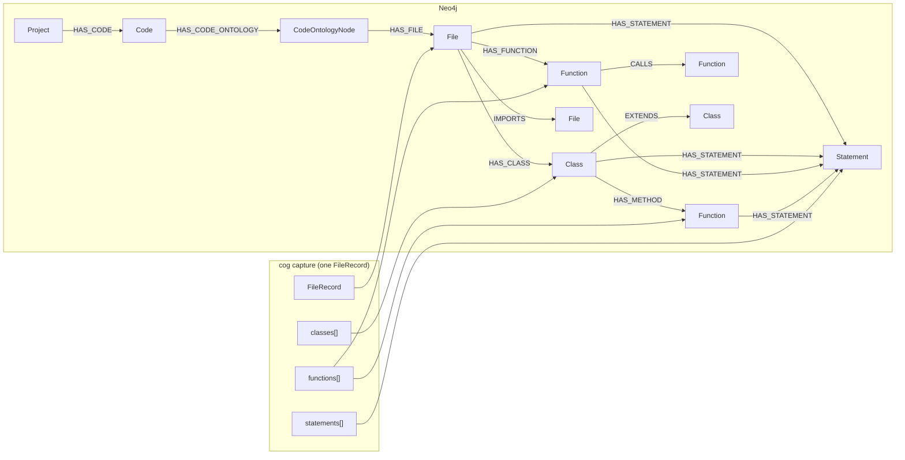
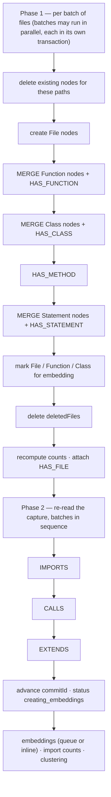
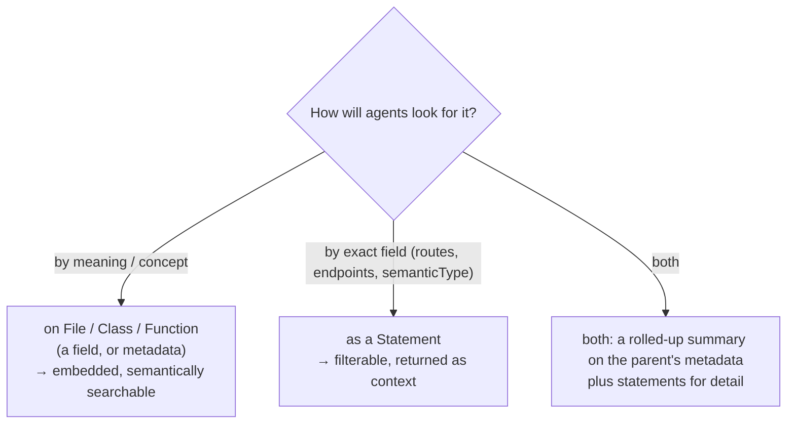

# Capture-to-Graph Mapping

This page explains what the Breeze backend does with a cog capture: which Neo4j nodes and edges it
creates, which fields it keeps, what is embedded for semantic search, and what happens on
re-ingest. It is for anyone deciding **where to put** a captured value, or wondering why
something cog emits does or doesn't appear in the graph.

It expands [§9 of the architecture doc](../architecture.md#9-the-capture-contract-and-the-graph).
The backend code lives in the `breezeai-backend` repository. This page was checked against its
commit `49a28c6` (2026-10-06). Backend file names below are relative to that repository; most of
the logic is in `src/services/graphs/`.

> The backend owns this behaviour. If you find a difference between this page and the backend
> code, the code is right — please update this page.

**Contents**

1. [The big picture](#1-the-big-picture)
2. [Ingest entry points](#2-ingest-entry-points)
3. [Ingest order](#3-ingest-order)
4. [Nodes and their keys](#4-nodes-and-their-keys)
5. [Edges and how their targets are found](#5-edges-and-how-their-targets-are-found)
6. [Which properties are stored](#6-which-properties-are-stored)
7. [projectMetaData](#7-projectmetadata)
8. [Embeddings and search](#8-embeddings-and-search)
9. [Re-ingest and incremental updates](#9-re-ingest-and-incremental-updates)
10. [Known mismatches between cog and the backend](#10-known-mismatches-between-cog-and-the-backend)
11. [Checklist: adding a field or value](#11-checklist-adding-a-field-or-value)

---

## 1. The big picture

- Every node is scoped by `codeOntologyId` (one per onboarded repository) and `projectUuid`.
- Four labels come from the capture: `File`, `Class`, `Function` and `Statement`. `Project`,
  `Code` and `CodeOntologyNode` are created by the backend for each onboarded repository.
- `File`, `Function` and `Class` are embedded for semantic search. **`Statement` is not.**
  Statements are found by field filters or as children of a search hit ([§8](#8-embeddings-and-search)).

---

## 2. Ingest entry points

| Endpoint | Called by | What it does |
|---|---|---|
| `POST /code-ontology/generate` (multipart `.ndjson.gz`, max 200 MB) | `breezeai-cog --upload`, manual upload in the Breeze UI | First-time import. Checks the gzip, creates the CodeOntology record, stores the file, then imports it (`importFromS3GzAsync`). **No delete step.** |
| `POST /code-ontology/stream-ingest` (JSON: `storage_key`, `projectMetaData`, `deletedFiles`, `commitId`…) | cog's server mode (`/api/analyze-diff`) after uploading to S3 | Full or incremental ingest (`streamIngestAsync`). Re-ingested files are replaced; `deletedFiles` are removed. If there are no files and nothing deleted, it only moves the stored commit forward. |
| `PUT /code-ontology/upsert` (files in the JSON body) | Small in-body updates | One transaction: delete by path, then import everything. |

Controller: `src/controllers/code-ontology.controller.ts`. Service:
`src/services/graphs/code-ontology-graph.service.ts`.

---

## 3. Ingest order

`stream-ingest` runs in two phases. The capture file is read **twice**: once for nodes, once for
cross-file edges, because an edge can only be made when both ends exist.

- Deadlocked batches are retried (up to 5 times).
- The stored `commitId` only moves forward after a successful ingest.
- `/generate` runs the same steps without the deletes.

---

## 4. Nodes and their keys

| Label | Created from | Write | Identity |
|---|---|---|---|
| `File` | each `FileRecord` | `CREATE` (after deleting the old one) | UNIQUE `(path, codeOntologyId)` |
| `Function` | `functions[]` | `MERGE` | `captureId` (= cog `id`) + `codeOntologyId` (indexed) |
| `Class` | `classes[]` | `MERGE` | `captureId` (= cog `id`) + `codeOntologyId` (indexed) |
| `Statement` | `statements[]` | `MERGE` | UNIQUE `(captureId, codeOntologyId)`, `captureId` = cog `id` |

- The capture `id` is stored as **`captureId`**. The backend gives `File`, `Function` and `Class`
  nodes their own generated `id`. A `File` is matched by `path`, not by capture id.
- No nodes are created for decorators, external imports or packages.
- Old captures without statement ids get a fallback key
  (`path|startLine|endLine|method|endpoint`).

---

## 5. Edges and how their targets are found

This is the table that matters most for parser authors: **an edge only exists if the backend can
find the target the way it looks for it.**

| Edge | From → To | Capture field | How the target is found | If it isn't found |
|---|---|---|---|---|
| `HAS_FUNCTION` | File → Function | a function whose `parentId` is not a class | the File with the record's `path` | — |
| `HAS_CLASS` | File → Class | every entry in `classes[]` | the File with the record's `path` (the class's `parentId` is not used, so nested classes also hang off the File) | — |
| `HAS_METHOD` | Class → Function | `function.parentId` = a class `id` | by `captureId`. Classes from all files in the batch are considered, so a C++ method in a `.cpp` can attach to a class in a `.h` | no edge |
| `HAS_STATEMENT` | File / Class / Function → Statement | `statement.parentId` | matched against the same file's ids: classes and functions by `captureId`, the file by `path` | **statement skipped** |
| `IMPORTS` | File → File | `importFiles[]` | the File whose `path` is exactly that string | edge dropped silently |
| `CALLS` | Function → Function | `functions[].calls[]` | source by `captureId`; target = **every** Function with `name = calls[].name` and `path = calls[].path` | edge dropped silently (always, when `path` is empty) |
| `EXTENDS` | Class → Class | `classes[].extends` | **every** Class in the repository whose `name` equals the `extends` text | no edge |
| `HAS_FILE` | CodeOntologyNode → File | — | all files of the ontology | — |

Things that create **no** edge: `implements` (stored as a property only), `decorators`,
`externalImports`, `exports`.

What this means for cog:

| cog emits | Result in the graph |
|---|---|
| `calls: [{name: "findAll", path: "src/order.repo.ts"}]` | `CALLS` to `findAll` in that file (to every overload, if there are several) |
| `calls: [{name: "map"}]` (no path) | no edge — correct for external or unresolved calls |
| `extends: "BaseController"` | `EXTENDS` to every class named `BaseController` in the repo |
| `extends: "com.acme.BaseController"` or `"Repo<Order>"` | **no edge** — no class has that exact name |
| a statement whose `parentId` matches nothing in the file | the statement is not stored |

> **Decision —** cog resolves cross-file targets to a **file path**; the backend finds the node inside it.
> **Why:** cog can prove which file a call goes to, but often not which overload. The file path
> plus the name is the most precise target cog can stand behind. **Cost:** an overloaded callee
> gets an edge to every overload.

---

## 6. Which properties are stored

| Label | Policy | Stored | Notes |
|---|---|---|---|
| `File` | **Open** — everything except a strip list | `type`, `language`, `loc`, `framework`, `platform`, `uiRole`, `externalImports` (array), `imports` (= `importFiles`, array), `exports` (JSON string), `metadata` (JSON string), **and any extra key** | Removed: `id`, `functions`, `classes`, `importFiles`, `statements`. Added: `name`, `repositoryName`, `description`, `projectUuid`, `codeOntologyId`. |
| `Class` | **Open** — everything except a strip list | `name`, `type`, lines, `visibility`, `isAbstract`, `isSealed`, `uiRole`, `extends` (string), `implements` / `decorators` / `constructorParams` / `metadata` / `generics` (JSON strings), **and any extra key** | Removed: `id` (→ `captureId`), `parentId`. `path` = the file's path. |
| `Function` | **Allow-list** | `captureId`, `name`, `path`, lines, `type`, `returnType`, and when present `visibility`, `isStatic`, `isAsync`, `receiverType`, `uiRole`, `generics`; `params` / `decorators` / `metadata` / `calls` as JSON strings | `parentId` not stored. `path` = the file's path. **Any other field is dropped.** |
| `Statement` | **Allow-list** | `captureId`, `nodeType`, `semanticType`, `text`, `name`, `path`, lines, `method`, `endpoint`, `framework`, `handler`, `handlerLine`, `routeKind`, `isRegex`, `version`, `authRequired`, `requestDTO`, `responseDTO`, `dataAccessHint`, `platform`, `uiRole`, `isPartial`; `guards` / `keyFields` / `dataLoaders` as arrays; `decorators` as a JSON string | `parentId` not stored — the backend stores `parentName` and `parentType` (`function` / `class` / `file`) instead. `method` / `endpoint` default to `""`. **Any other field is dropped.** |

Further points:
- **`semanticType` is stored as-is.** The backend does not check it against a list, so a new
  value works at once and can be filtered on.
- **Nested values become JSON strings** (`metadata`, `decorators`, `params`…). They can be read
  and are included in embeddings (for File, Class, Function), but cannot be filtered on field by
  field. Filters on nested names (`metadata.kind`) are rejected.
- **Limits per file:** at most 5,000 functions (100 if the file looks minified), 100 classes,
  and 2,000 statements per parent (`MAX_STATEMENTS_PER_PARENT`). Anything over the limit is not stored.

> **Decision —** `File` and `Class` are open; `Function` and `Statement` are allow-listed.
> **Why:** functions and statements are by far the most numerous nodes, so their shape is kept
> fixed and small. Files and classes need room for parser-specific detail. **Cost:** a new
> `Function` or `Statement` field needs a backend change at the same time. Without it, the field
> is silently dropped (the allow-list is in `file-funcation-graph.service.ts` and in
> `normalize()` / `setClause()` in `file-statement-graph.service.ts`).

---

## 7. projectMetaData

The first line of a capture (`projectMetaData`) is **skipped by the graph ingest** (it has no
`path`). What the backend uses depends on the endpoint:

| Endpoint | Source of the summary | Kept |
|---|---|---|
| `/stream-ingest` | the `projectMetaData` object in the request body | `repositoryName`, `repositoryPath`, `analyzedLanguages`. File / function / class / LOC counts are **recomputed from the graph**. `configs`, `generatedAt`, `toolVersion` are accepted but not stored. |
| `/generate` | none | stored as `{}` |
| `/upsert` | the request body | totals, languages, repository name and path, commit |

So `projectMetaData.configs` (dependencies, build tools, docker) does not currently reach the
graph. The same information is available per file in `File.metadata` of the config files.

---

## 8. Embeddings and search

| Label | Embedded? | Text that is embedded |
|---|---|---|
| `File` | Yes | path, name, language, framework, type, LOC, UI role, platform, imports, external imports, function signatures, class names, **`metadata`** |
| `Function` | Yes | name, file, type, visibility, modifiers, decorator names, params, return type, generics, called names, **`metadata`** |
| `Class` | Yes | kind, name, file, modifiers, decorator names, constructor params, `extends`, `implements`, generics, **`metadata`** |
| `Statement` | **No** | — (statement embedding is switched off in `graph-embed.service.ts`; there is no Statement vector index) |

How agents reach the graph (Breeze MCP tools → backend):

| Path | Finds | Good for |
|---|---|---|
| Semantic search (`Code_Graph_Search` → `POST /code-ontology/:projectUuid/semantic-search`) | File, Function, Class by meaning (vector search) | "Where is order checkout handled?" |
| Context of a hit | The hit's direct children: a File's file-level statements and class/function stubs; a Class's statements and methods; a Function's statements | Seeing what's inside a result |
| Label query (`Get_Code_Nodes_By_Label` → `GET /code-ontology/:uuid/:label`) | File, Function, Class, **Statement**, by field filters (`$eq`, `$in`, `$contains`, `$regex`, `$startsWith`…) | "All `route` statements", "every `api_call` to `/billing`" |

Where to put a captured value:

> **Decision —** statements are not embedded.
> **Why:** not recorded — the backend code only says it is "intentionally disabled". The likely
> reason is volume: statements far outnumber every other node. *(To confirm with the backend
> owners.)* **Cost:** a value that lives only on a
> Statement can't be found by meaning. For example, when enum members moved from
> `Class.metadata` to `enum_member` statements, searches like "Status enum active inactive"
> scored the enum class noticeably lower, because the member names were no longer part of
> its embedded text. They are still found by text filters, and come back with the class.

---

## 9. Re-ingest and incremental updates

| Situation | What happens |
|---|---|
| A file is re-ingested | All its `Statement`, `Function`, `Class` and `File` nodes are deleted (by path), then recreated. Nothing old survives. |
| A file was deleted in the repo | Removed by path from `deletedFiles`. |
| The same capture is ingested twice | Same result: Function, Class and Statement are merged on `captureId`, edges are merged. |
| Embeddings | Recreated nodes are re-embedded. |

> **Watch out — incoming edges on incremental ingest.** Phase 2 rebuilds edges **from** the files
> in the capture. When only some files are re-ingested, edges that pointed **into** them from
> unchanged files (`IMPORTS`, `CALLS`, `EXTENDS`) were removed with the old nodes and are not
> recreated. This comes from reading the code, not from checking a live graph; it should be
> confirmed before anyone relies on incremental graphs for impact analysis.

Because node identity is `captureId`, which includes line numbers
([ids](../architecture.md#8-ids-and-linking)), code that moves to another line becomes a new
node on re-ingest. The old one is removed by the delete step.

---

## 10. Known mismatches between cog and the backend

| # | Mismatch | Effect | Possible fix |
|---|---|---|---|
| 1 | cog emits `extends` as written in the source (`com.acme.Base`, `Repo<Order>`); the backend matches it to a class **name** exactly | No `EXTENDS` edge for qualified or generic parents; an edge to **every** same-name class otherwise | cog sends the resolved file path (as for `calls[]`), or the backend matches on the simple name plus path |
| 2 | `implements` has no edge | Interface implementations can't be traversed | Add an `IMPLEMENTS` edge in the backend |
| 3 | `CALLS` targets are matched by name and file only | An overloaded callee gets an edge to every overload | Accept (cog can't prove the overload), or carry the callee's arity |
| 4 | `generics` is a string in cog but is JSON-encoded again by the backend | Stored with extra quotes (`"\"<T>\""`) | Store the string as-is |
| 5 | `projectMetaData.configs` is not stored | Repository-level config summary is missing from the graph | Persist it on the CodeOntology record |
| 6 | Incoming edges are not rebuilt on incremental ingest ([§9](#9-re-ingest-and-incremental-updates)) | Edges from unchanged files are lost | Rebuild edges that target re-ingested paths |
| 7 | `Statement` nodes have no `createdAt` / `updatedAt` | Can't tell when a statement was last written | Set them in the statement write |

---

## 11. Checklist: adding a field or value

| You are adding… | Backend change needed? |
|---|---|
| A new `semanticType` value | No — stored and filterable at once. Document it in the Target Spec. |
| A new field on `File` or `Class` | No, if it's a plain value. A nested object becomes a JSON string (or may be rejected), so prefer `metadata`. |
| A new field on `Function` or `Statement` | **Yes** — add it to the allow-list in the same release, or it is dropped. |
| A new edge type, or a new kind of edge target | **Yes** — and a decision first ([Extending Capture §5](../../skills/extend-capture/SKILL.md#5-choosing-how-to-store-what-you-capture)). |
| Content that agents should find by meaning | Put it on File / Class / Function (field or `metadata`), not only on a Statement ([§8](#8-embeddings-and-search)). |

The external description of the graph model is the
[Code Ontology Parser Target Spec](https://accionlabs.atlassian.net/wiki/spaces/~5cfa0cffd898610dbf3bacf1/pages/2483453956/Code+Ontology+Parser+Target+Spec+Neo4j+Graph+Model).
</content>
</invoke>
