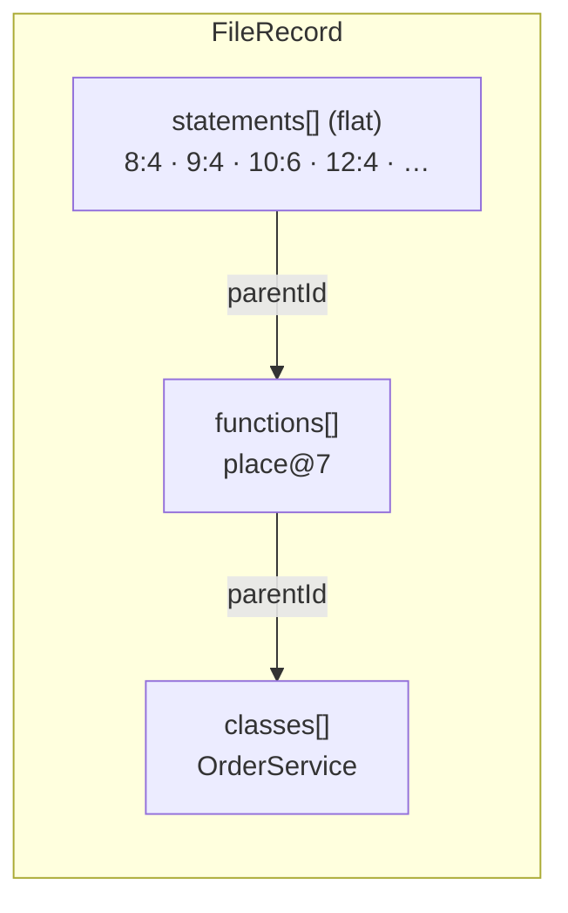
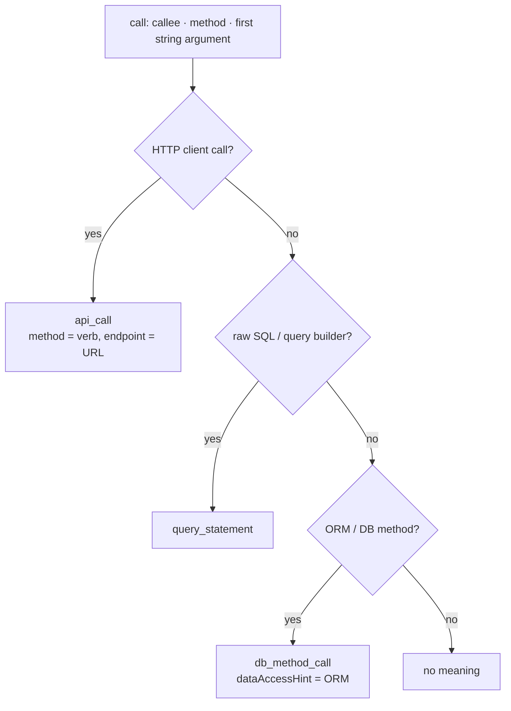
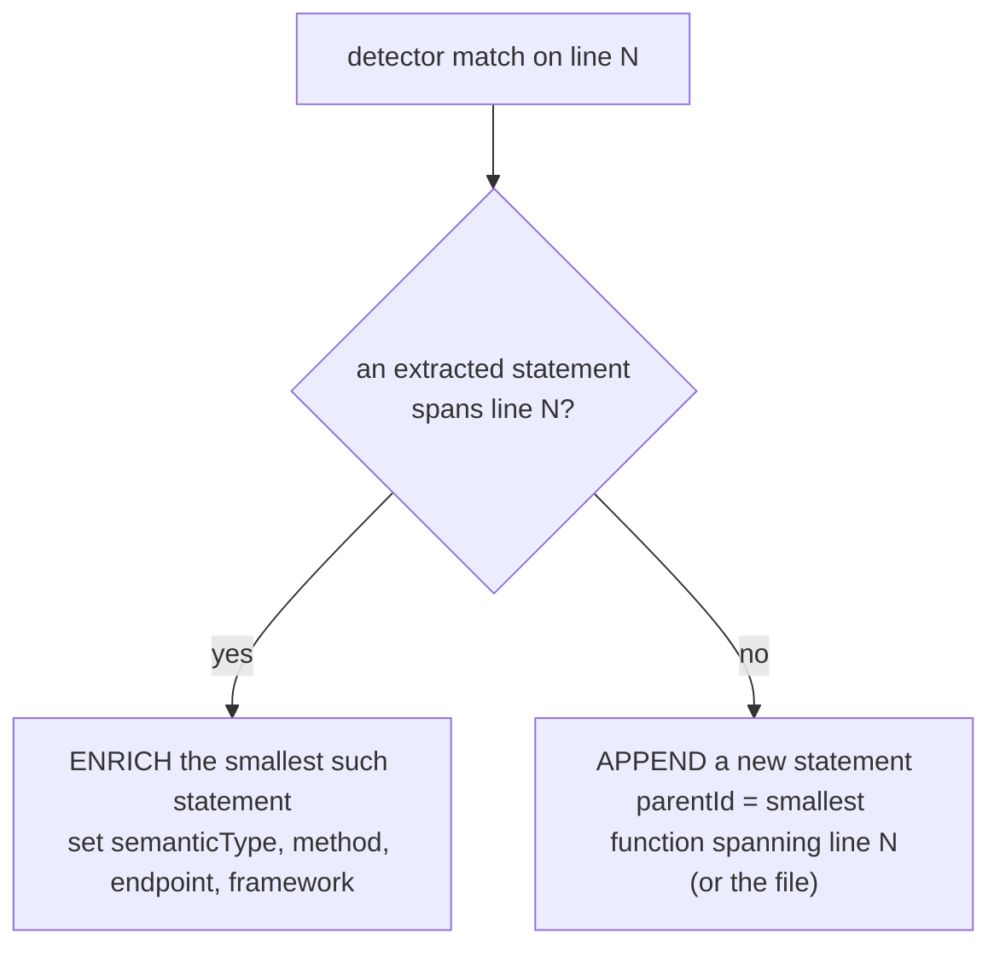

# Statement Model

This page explains how cog turns the inside of a file — the lines within functions, classes and
the file itself — into `Statement` records. It covers what is emitted, how each statement gets
its meaning, how detectors add to it, and how comments, enum members and very large statements
are handled.

It expands [§7 of the architecture doc](../architecture.md#7-the-statement-model). The record
shape is defined in `src/breezeai_cog/schemas/capture.py` (`Statement`) and the `semanticType`
values in `src/breezeai_cog/schemas/enums.py`.

All examples on this page are real cog output (some fields left out for space).

**Contents**

1. [What a statement is](#1-what-a-statement-is)
2. [Which statements are emitted](#2-which-statements-are-emitted)
3. [Giving a statement its meaning](#3-giving-a-statement-its-meaning)
4. [Framework detectors: enrich or append](#4-framework-detectors-enrich-or-append)
5. [Comments](#5-comments)
6. [Enum members](#6-enum-members)
7. [Very large statements](#7-very-large-statements)
8. [Turning statements off](#8-turning-statements-off)
9. [Rules for parser authors](#9-rules-for-parser-authors)

---

## 1. What a statement is

A statement is one unit of code with a line range, linked to the file, class or function that owns
it. Every statement has two types:

| Field | Answers | Always set? | Example |
|---|---|---|---|
| `nodeType` | *What is it syntactically?* — the tree-sitter node type | Yes | `expression_statement`, `if_statement`, `line_comment` |
| `semanticType` | *What does it mean?* | Only when detected | `route`, `api_call`, `db_method_call`, `comment` |

The other fields depend on the meaning:

| Fields | Used by |
|---|---|
| `id`, `parentId`, `nodeType`, `text`, `startLine`, `endLine`, `path` | Every statement |
| `name` | Declarations (`int retries = 3` → `retries`), enum members |
| `method`, `endpoint`, `framework` | Routes, API calls, events |
| `handler`, `handlerLine`, `routeKind`, `isRegex`, `authRequired`, `guards`, `requestDTO`, `responseDTO`, `version`, `dataLoaders` | Routes |
| `dataAccessHint` | `db_method_call` (which ORM / database) |
| `keyFields` | `graphql_entity` |
| `platform` | `iac_*` |
| `isPartial` | Parts of a split statement ([§7](#7-very-large-statements)) |

Statements are stored **flat** on `FileRecord.statements`, not nested inside functions or
classes. Nesting is expressed by `parentId` and line ranges.



> **Decision —** flat statements linked by `parentId`.
> **Why:** a flat list is easy to stream, split and load (each statement becomes one
> `HAS_STATEMENT` edge), and detectors can append to it without rebuilding a tree.
> **Cost:** to see "the statements of a function", filter by `parentId`.

> **Decision —** `nodeType` is always a real grammar node type, or the single value `synthetic`.
> **Why:** it stays truthful and checkable against the source. A statement with no node of its
> own (a route derived from an annotation such as `@GetMapping`) uses `synthetic` rather than an
> invented name like `route_annotation`. The meaning goes in `semanticType`.

---

## 2. Which statements are emitted

Each language parser lists three sets in its `mappings.py`:

| Set | Meaning | Java example |
|---|---|---|
| `EMIT_TYPES` | Node types that become statements | declarations, `expression_statement`, `if_statement`, `return_statement`, `throw_statement`… |
| `CONTROL_FLOW` | The control-flow subset of `EMIT_TYPES` | `if_statement`, `for_statement`, `try_statement`, `catch_clause`… |
| `NESTED_SCOPES` | Scopes extracted as their own `Class` / `Function` | `class_declaration`, `method_declaration`, `lambda_expression`… |

The extractor walks the scope and emits every `EMIT_TYPES` node it meets. How it treats nested
scopes depends on where it is:

| Walking… | Nested scopes (classes, methods, lambdas) | Why |
|---|---|---|
| The file root or a class body | **Stops** at them | They are extracted as their own `Class` / `Function`, with their own statements. |
| A function body | **Walks into inline lambdas** and gives their statements to the function | A lambda is not a `Function` record, so its statements belong to the enclosing function. |

**Example** (Java)

```java
public void place(Order o) {
  int retries = 3; // max attempts
  if (repo.existsById(o.id)) {
    throw new IllegalStateException("dup");
  }
}
```

| `id` | `nodeType` | `text` |
|---|---|---|
| `…:8:4` | `local_variable_declaration` | `int retries = 3; // max attempts` |
| `…:9:4` | `if_statement` | `if (repo.existsById(o.id)) {` |
| `…:10:6` | `throw_statement` | `throw new IllegalStateException("dup");` |

Two details:
- A **control-flow** statement keeps only its header line as `text`, but its line range covers
  the whole body. Its body's statements are emitted on their own.
- A **comment on the same line** as a statement is folded into that statement's `text`
  (`// max attempts` above), so it isn't emitted twice.

---

## 3. Giving a statement its meaning

For each emitted statement, the extractor finds the calls inside its own expression and asks the
shared classifier (`parsers/detection/`, `classify_call`) what each call is:



The order matters: API is checked first (so Django's `objects.get` is not mistaken for an HTTP
GET only because of its name), and raw queries before ORM calls (so `createNativeQuery("SELECT …")`
is a `query_statement`). If no call matches but the statement contains a string with real SQL
structure, it becomes a `query_statement`:

```java
String q = "SELECT id, total FROM orders WHERE id = ?";
```
→ `nodeType: local_variable_declaration`, `semanticType: query_statement`, `name: q`.

### Several calls in one statement

A statement holds a **single** `semanticType`. When one statement contains several classified
calls, the first goes on the statement itself and each further one gets its own record at the
call's position, with `nodeType` set to the call node:

```ts
await axios.post("/billing/charge", { id }).then(() => prisma.order.update({ where: { id }, data: {} }));
```

| `id` | `nodeType` | `semanticType` | Fields |
|---|---|---|---|
| `orders.ts:8:2` | `expression_statement` | `api_call` | `method: POST`, `endpoint: /billing/charge` |
| `orders.ts:8:57` | `call_expression` | `db_method_call` | `method: update`, `dataAccessHint: prisma` |

### Calls inside a control-flow header

A control-flow statement **never** carries a `semanticType`. A classified call in its header gets
its own record:

```ts
if (await prisma.order.findUnique({ where: { id } })) {
```

| `id` | `nodeType` | `semanticType` |
|---|---|---|
| `orders.ts:5:2` | `if_statement` | — |
| `orders.ts:5:12` | `call_expression` | `db_method_call` (`findUnique`, `prisma`) |

> **Decision —** one meaning per record; extra meanings become extra records.
> **Why:** fields like `method` and `endpoint` stay single-valued, so a query such as
> "all POST calls to /billing" is a simple filter. **Cost:** one line of source can produce
> several records.

> **Decision —** the classifiers are shared and conservative.
> **Why:** the same rules serve every language, so they must not fire on look-alikes
> (`Array.find`, `cache.get`, `"Create account"`). Ambiguous verbs need a positive database
> receiver before they count. **Cost:** some real calls through unusual wrappers are missed.
> A parser can pass the names of known HTTP clients or typed repositories for its file to
> widen recognition safely.

---

## 4. Framework detectors: enrich or append

Framework detectors (routes, event buses, schedulers) run after the language extraction, on the
same tree. For each thing they find, they look for an existing statement covering that line:



**Enrich** (the usual case) — from the Vert.x example in the architecture doc:

```java
vertx.eventBus().publish(ORDERS, ctx.body().asJsonObject());
```
The Java extractor already emitted this as an `expression_statement`. The Vert.x detector sets
`semanticType: eventbus_publish`, `framework: vertx` and `endpoint: orders.created` on that same
record.

**Append** — when no extracted statement exists, for example a call in a lambda used as a field
initialiser (outside any function body), or a route that comes from an annotation:

```java
@GetMapping("/orders/{id}")
public Order get(@PathVariable String id) { … }
```
→ a new record with `nodeType: synthetic`, `semanticType: route`, `method: GET`,
`endpoint: /orders/{id}`, `handler: get`, parented to the method.

> **Decision —** enrich first, append only when nothing is there.
> **Why:** one piece of source maps to one record, so nothing is double-counted, and the
> statement keeps its real `nodeType` and text. **Cost:** the detector must use the same ids
> and line numbers as the extractor ([ids](../architecture.md#8-ids-and-linking)).

Two further rules apply to detectors:
- **Route emitters skip fixture files** (`*.stories.*`, `mocks/`, `fixtures/`…), whose routers
  are throwaway test set-ups.
- **Constants are folded** into `endpoint` when they are true compile-time constants (`ORDERS` →
  `orders.created`). Otherwise the endpoint is left empty. See
  [Cross-file resolution](cross-file-resolution.md).

---

## 5. Comments

Comments are captured by **one shared pass** over the whole file (`parsers/comments_common.py`),
the same for every language. Each comment becomes a statement with `semanticType: comment`, and
keeps its real `nodeType` (`comment`, `line_comment`, `block_comment`; a Python docstring is a
`string`).

**Which record owns a comment** — tried in this order:

| Rule | When | Example |
|---|---|---|
| 1. **Bind ahead** | The next declaration starts right after the comment, with no statement in between, inside the same scope | A doc comment above a method is owned by that method |
| 2. **Containment** | Otherwise, the innermost function or class that contains the comment | A note inside a method body |
| 3. **File** | Otherwise | A licence header |

```java
/** Saves an order and notifies billing. */
public void place(Order o) { … }
```
→ `nodeType: block_comment`, `semanticType: comment`, `parentId: …#OrderService#place@7`.

**Not emitted twice.** A comment that is already part of another statement's text (a same-line
trailing comment, or a comment inside a multi-line declaration) is skipped. Consecutive
single-line comments are merged into one record.

> **Decision —** one whole-file comment pass, instead of capturing comments inside each extractor.
> **Why:** the per-scope extractors don't visit every place a comment can be (file root, class
> bodies, comments placed just outside a declaration). One pass based on the line ranges the
> extractor already produced handles all languages the same way, and only needs each
> language's comment node types (`COMMENT_TYPES`).
> **Cost:** one extra tree walk per file. The binding and dedup lookups use tables built once per
> file (sorted starts, a running maximum of span ends, an open-scope stack), never a scan of all
> statements per comment, so the pass stays linear in file size.

---

## 6. Enum members

Each enum member becomes a statement under its enum class, with `semanticType: enum_member`, the
member's name in `name`, and its full source (including any value) in `text`:

```java
enum Status { ACTIVE("A"), CLOSED("C"); … }
```

| `parentId` | `nodeType` | `semanticType` | `name` | `text` |
|---|---|---|---|---|
| `…#OrderService.Status` | `enum_constant` | `enum_member` | `ACTIVE` | `ACTIVE("A")` |
| `…#OrderService.Status` | `enum_constant` | `enum_member` | `CLOSED` | `CLOSED("C")` |

> **Decision —** enum members are statements with an `enum_member` marker, not a list in `Class.metadata`.
> **Why:** a single cross-language filter finds "all enum members", whatever each grammar calls
> them. The enum's body is still treated as its own scope, so methods inside an enum are
> extracted normally. **Cost:** the backend embeds class metadata but not statements, so members
> no longer add to the enum class's semantic-search score. They are still found by label/text
> queries and returned with their class. See [Capture-to-graph mapping](graph-mapping.md).

---

## 7. Very large statements

A statement can be enormous: a generated code blob, a giant string literal, a whole data
document. The backend rejects statements above a size limit, so cog splits them **once, at
output time** (`emit/split.py`), for every parser:

| Rule | Detail |
|---|---|
| Limit | `statement_text_limit` (default 8,000 characters) |
| Split | Into ordered parts; ids get `#part1of3`, `#part2of3`… |
| Where | At a line break inside the window when possible; otherwise a hard cut |
| Flag | Every part has `isPartial: true` |
| Meaning | Only the **first** part keeps `semanticType` and its fields, so one route never becomes three |
| Lossless | Concatenating the parts gives back the original text — unless `max_statement_parts` is set and exceeded, in which case the tail is dropped, a visible `…[+N chars dropped …]` marker is added and a warning is logged |

> **Decision —** split instead of truncate, in one place.
> **Why:** truncation loses the end of the text silently, and having each parser truncate in its
> own way would be inconsistent. **Cost:** a reader must join the parts to see the whole text.

A separate guard protects against generated code with extremely long string concatenations
(`"a" + b + "c" + …`, hundreds of levels deep). When the depth passes `max_concat_depth`
(default 100), cog stops trying to work out an endpoint from it. The statement is still
captured; only its `endpoint` is left empty, and one summary line per file is logged.

---

## 8. Turning statements off

Statement capture is **on by default**. With `--no-capture-statements`
(`BREEZEAI_COG_CAPTURE_STATEMENTS=false`) **no** statements are emitted: no structural statements,
routes, calls, events, comments or enum members. Files, classes, functions, imports and calls
(`calls[]`) are still captured.

> **Decision —** one switch for all statements.
> **Why:** statements are most of a capture's size. Some uses only need the structure, and a
> single switch is easy to reason about. **Cost:** every extractor and detector must respect
> `ctx.capture_statements`.

---

## 9. Rules for parser authors

- Emit statements only through the shared helpers (`classify_statement`, `member_statement`,
  `emit_enum_members`) and the id helpers in `emit`, with one `seen_ids` set per file.
- Check `ctx.capture_statements` before emitting anything; route emitters also check
  `is_fixture_file`.
- Enrich an existing statement before appending a new one.
- Use a real grammar `nodeType`, or `synthetic`. Never invent a node type.
- Never put a `semanticType` on a control-flow statement.
- Reuse an existing `semanticType` where it fits. A new value needs a decision first
  ([Extending Capture §5](../../skills/extend-capture/SKILL.md#5-choosing-how-to-store-what-you-capture)).
- Don't truncate text in the parser; splitting happens at output.

The step-by-step is in the [Parser Reference](../parser-reference.md).
</content>
</invoke>
