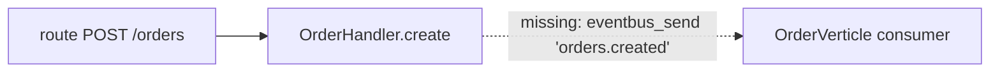

# Parser Review & Gap Analysis Guide

How to review a `breezeai-cog` parser (a new one, or a change to an existing one), and how to
write up what it misses as a **gap analysis report**. It is written for human reviewers and
for coding agents running a gap analysis, so every check says **what to look at**, **how to
check it**, and **what counts as a failure**.

Related documents:

| Document | Use it for |
|---|---|
| [`skills/extend-capture/SKILL.md`](../skills/extend-capture/SKILL.md) | The rules a parser must follow (reliability, honest-null, the three extension categories). The review checks the code against these rules. |
| [`docs/parser-reference.md`](parser-reference.md) | The step-by-step for building a parser, and its conventions checklist (§4). |
| [Architecture](architecture.md) *(to be written)* | Layering, the parse pipeline and its pass budget, and what counts as a core change. |
| [`src/breezeai_cog/schemas/capture.py`](../src/breezeai_cog/schemas/capture.py), [`enums.py`](../src/breezeai_cog/schemas/enums.py) | The capture contract: every field and `semanticType` that *can* be captured. |
| [Code Ontology Parser Target Spec (Neo4j Graph Model)](https://accionlabs.atlassian.net/wiki/spaces/~5cfa0cffd898610dbf3bacf1/pages/2483453956/Code+Ontology+Parser+Target+Spec+Neo4j+Graph+Model) | The external spec the backend ingests against. |

---

## Part A — Reviewing a parser

Work through the sections in order. §1–§3 are about **where** the change lives and whether it
is safe; §4–§6 are about **how** it is built; §7–§9 are about **what** it captures. Record each
finding as you go — they become the issues in the report (Part B).

### 1. Scope: which files did the change touch?

**Rule:** a parser-specific change lives only in the parser's own directory and its test file.
Anything outside that is a wider change and gets a stricter review.

List the changed files and sort each into one of the zones below:

```bash
git diff --name-only main...HEAD
```

| Zone | Paths | Who it affects | Review level |
|---|---|---|---|
| **Parser-local** | `parsers/<lang>_<framework>/**`, `tests/unit/test_<x>_parser.py` | This parser only | Normal |
| **Language parser** | `parsers/<lang>/**` (when the work is for a framework) | Every framework built on this language | High — see §1.1 |
| **Shared family helper** | e.g. `parsers/vertx_common.py` (shared by `java_vertx` and `groovy_vertx`) | Every parser that imports it | High |
| **Core** | `schemas/`, `core/`, `emit/`, `parsers/base.py`, `parsers/treesitter.py`, `parsers/statements_common.py`, `parsers/comments_common.py`, `parsers/callresolve.py`, `parsers/index_common.py`, `parsers/constfold.py`, `parsers/detection/`, `cli.py`, `config.py` | Every parser | Highest — architectural change, see §1.2 |

#### 1.1 Language-parser changes made during framework work

A framework parser subclasses its language parser and reuses its `extract`. So a change to
`parsers/java/` made while building `java_vertx` also changes the output for Spring Boot,
JAX-RS and plain Java files.

Check that:
- the change is **framework-neutral** — no framework names, imports or annotations hard-coded
  in the language parser (see `extend-capture` §6, "Never bake framework-specific logic into a
  base language parser");
- if it is a structure-shaped detector, it is a gated `detect_*` pass with a cheap byte guard
  (`extend-capture` §3C), not an unconditional walk;
- the other frameworks' tests for that language still pass, and their output on a real repo
  did not change unexpectedly (diff the capture before and after);
- it is consistent with the [architecture](architecture.md).

#### 1.2 Core changes

A core change is an architectural change: it changes behaviour for **every** parser. Expect:
- a stated reason why it could not be done inside the parser;
- a before/after capture diff on at least one repo per affected language;
- for `schemas/`: a matching backend / spec update when a field is added to a restricted node
  (unknown fields on restricted nodes are dropped silently at ingest — `extend-capture` §5).

### 2. Structure: does the parser follow the standard layout?

A **language parser** package:

```
src/breezeai_cog/parsers/<lang>/
├─ __init__.py      # PARSERS = [<Lang>Parser()]
├─ parser.py        # <Lang>Parser(BaseParser): parse_file() parses, extract() consumes the tree
├─ mappings.py      # EMIT_TYPES / CONTROL_FLOW / NESTED_SCOPES, STATEMENT_TYPES, FRAMEWORKS
├─ imports.py       # import extraction + resolution to repo-relative paths
├─ functions.py     # build_function(...) -> (Function, list[Statement])
├─ classes.py       # build_class(...) -> (Class, list[Function], list[Statement])
├─ statements.py    # flat statement extraction + classify_call wiring
├─ constants.py     # (optional) constant collection, e.g. for address/route folding
├─ ignore.txt       # language-scoped ignore defaults (applied post-scan)
└─ include.txt      # language-scoped force-includes
tests/unit/test_<lang>_parser.py
```

A **framework parser** package:

```
src/breezeai_cog/parsers/<lang>_<framework>/
├─ __init__.py      # PARSERS = [<Framework>Parser()]
├─ parser.py        # subclasses <Lang>Parser: name, priority, frameworks, claims(), parse_file()
└─ routes.py        # detection -> list[Statement]  (or events.py etc., named by what it detects)
tests/unit/test_<framework>_parser.py
```

Check against `parser-reference.md` §4 (conventions checklist). The items that most often fail:

- `parse_file` / `extract` split missing, so the framework parser re-parses;
- ids built by hand instead of through `emit.*` + `disambiguate`, so `parentId`s don't match
  what the base parser assigned;
- statements nested on a `Function`/`Class` instead of flat on `FileRecord.statements`;
- semantic statements emitted without the `ctx.capture_statements` gate, or route emitters that
  don't skip fixture files (`is_fixture_file`);
- `build_index` that parses every file in a serial loop instead of `parallel_map`.

### 3. Rules: was it built according to `extend-capture`?

Go through `skills/extend-capture/SKILL.md` §9 (reliability checklist). The key questions:

| Question | Failure looks like |
|---|---|
| Right category? (§3) | An ORM / HTTP client / messaging SDK written as a one-per-file parser, so it displaces the server framework and its routes disappear. |
| Honest-null? (§1) | A field filled with a guess — e.g. an `endpoint` built from a variable name, or a `calls[].path` pointing at a file chosen by name similarity. |
| Ambiguity raised? (§2) | A new `semanticType`, node type, field or edge added without a recorded decision. |
| Vocabulary reused? (§5) | A new statement kind invented where an existing `semanticType` fits. |

### 4. Claims: does the framework parser own the right files?

Exactly one parser handles each file: the highest-`priority` parser whose `claims(path, source)`
is true (`core/registry.py::select`). The base language parser is the priority-0 fallback.

**Rule:** a framework's `claims()` must not overlap with another framework of the same language,
**unless** one framework is built on the other (a *derived* framework). In that case the derived
framework must have the **higher** priority.

| Situation | Example | Verdict |
|---|---|---|
| Derived framework, higher priority | NestJS (`priority = 20`) claims `@nestjs/`; it is built on Express (`priority = 10`). A NestJS controller that also imports `express` goes to NestJS. | Correct |
| Unrelated frameworks, same priority, both match | Spring Boot claims `org.springframework`, Vert.x claims `io.vertx` — both `priority = 10`. A file importing both is claimed by both; `select` uses `max()`, so the **registration order** decides silently. | Gap — either make the claims exclusive or decide the priority explicitly. |
| Claim too broad | A claim on a common word (e.g. `b"Router"`) pulls in files from other frameworks or plain code. | Gap — false positive ownership. |
| Claim too narrow | A claim on one import form only (`import io.vertx.core.Vertx`) misses wildcard imports, re-exports or fully-qualified use. | Gap — files fall back to the base parser and lose their routes. |

How to check: for each pair of frameworks in the language, look for real files that match both
claim strings (`grep -l` on a dogfood repo), and see which parser won (`FileRecord.framework`).

### 5. Derived data: no false positives

Some values are **inferred**, not read directly from the syntax. Each one is a place where the
parser can be confidently wrong. Check every one of them against real code:

| Derived value | Where it is decided | Example of a false positive to look for |
|---|---|---|
| File ownership | `claims()` | A file that only *mentions* `io.vertx` in a comment or string is claimed as Vert.x. |
| `semanticType` = `api_call` / `query_statement` / `db_method_call` | `parsers/detection/` (`classify_call`) | `cache.get(key)` tagged as an HTTP `GET`; `"select an option"` tagged as SQL; `list.find(x)` tagged as a DB call. |
| `semanticType` = `route` | framework `routes.py` | A test helper `router.get(...)` in a non-fixture file; a method named `get` on an unrelated object. |
| `semanticType` = `eventbus_send` / `eventbus_publish` / `eventbus_consumer` | e.g. `parsers/java_vertx/events.py` | A user wrapper method also called `send(...)` tagged as an event-bus send. |
| `semanticType` = `service_proxy`, `verticle_deploy`, `timer` | framework detectors | A class with an annotation that merely shares the simple name `ProxyGen` from another library. |
| `endpoint`, `method`, `routeKind` | detectors, constant folding (`constfold.py`) | An endpoint folded from the wrong constant; a path concatenated from a router prefix that is never mounted. |
| `calls[].path`, import resolution | `callresolve.py`, `imports.py`, `build_index` | A call resolved to a same-named class in another module. |
| `Class.type`, visibility, `isStatic` | `classes.py` / `functions.py` | A defaulted value presented as if it was read (e.g. every member `public`). |

For each derived value, the test suite should contain at least one **negative** case (a
look-alike that must *not* be tagged).

### 6. Performance and complexity

#### 6.1 Number of passes

Performance is the first concern for cog: it runs over very large repositories. The
[architecture](architecture.md) defines a fixed pass budget so every parser costs about the
same per file. In short:

| Stage | Expected cost |
|---|---|
| Scan | One directory walk; no file is read for classification. |
| `build_index` (optional) | Once per repo, parallelised with `parallel_map`, only when cross-file resolution is needed. |
| Parse | **One** `parse_source` per file. A framework parser reuses the base parser's tree via `extract`. |
| Extraction | A fixed number of tree walks per file (e.g. imports, symbol tables, declarations, comments) — never one walk per item found. |
| Framework detection | Off-the-record (reads the `FileRecord`, no walk) where possible; otherwise one walk, behind a cheap byte guard. |
| Embedded-DSL re-parse | Only on the embedded fragment, with `ctx.parse_timeout_micros`. |

Flag any of the following:
- a second `parse_source` on the whole file;
- a full-tree walk per detected item (nested walks → O(n²) on large files);
- a `detect_*` pass that runs on every file with no byte guard;
- `build_index` that reads or parses every file serially;
- per-file work that depends on repo size (e.g. scanning `record.statements` inside a loop
  over statements).

Measure it: run capture on a large repo before and after the change with the same `--jobs`
and compare the wall time and the per-language parse time in the run log.

#### 6.2 Code complexity

Code that is hard to read is hard to review and will drift. Check for:
- long functions doing several jobs (detect + resolve + build the statement);
- deeply nested conditionals on node types — a lookup table in `mappings.py` is usually clearer;
- logic copied from another parser or from `parsers/detection/` instead of reused;
- special cases for one repository's naming.

#### 6.3 Pros and cons

For the overall approach the parser takes (AST walk vs off-the-record, an index vs per-file,
constant folding vs leaving values null), write down the pros and cons in the report. This makes
the trade-off explicit for the next person who changes it.

### 7. Coverage: what *should* be captured?

Build the list of things to capture from **outside** the parser, then check the parser
against it. Do not derive the list from the parser's own code.

1. **Official references.** Use the language specification and the framework's official
   documentation to list every construct that matters for the code graph (see the checklist
   in §7.1). Note the version — older framework versions often use different APIs (for
   example Vert.x 2.x `org.vertx` vs 3.x+ `io.vertx`).
2. **The capture contract.** For every field and `semanticType` in `capture.py` / `enums.py`,
   decide whether this language/framework can produce it, and check whether it does.
3. **The Target Spec** (Confluence, linked above). Check that every field and value the parser
   emits is listed in the spec, and list any that are not (they may be dropped on ingest or
   need a spec update).

#### 7.1 Element checklist

| Area | What to check |
|---|---|
| **Declarations** | Classes, interfaces, enums, records, structs, traits/modules; top-level and nested/inner classes; anonymous classes; functions, methods, constructors, lambdas/closures assigned to names. |
| **Signatures** | Parameters with types, defaults and varargs; return types; generics / type parameters; `async` / coroutines / generators; visibility and static modifiers. |
| **Heritage** | `extends`, `implements`, mixins; base classes that live in another file (needs `build_index`). |
| **Decorators / annotations** | Every annotation on classes, methods **and parameters**, with arguments. One row per decorator form the framework uses. |
| **Routes** | Every route form: annotations, router calls (`router.get(...)`), chained builders, sub-routers and mounts, path prefixes, regex routes, method-less routes. Fields: `method`, `endpoint`, `routeKind`, guards / auth, request / response DTOs. |
| **Statements with a `semanticType`** | `route`, `api_call`, `db_method_call`, `query_statement`, `eventbus_send`, `eventbus_publish`, `eventbus_consumer`, `verticle_deploy`, `service_proxy`, `timer`, `graphql_entity`, `data_model`, `structured_data`, `comment`, `enum_member`, and the `iac_*` values for config parsers. Check each one that applies **wherever** it can appear — including inside lambdas and callbacks, which the base extraction skips as nested scopes. |
| **Imports / calls** | Relative and internal imports resolved to repo-relative paths; external imports listed; `calls[]` resolved where the target is certain. |
| **Configs** | Framework config files (YAML / JSON / properties / HCL) handled by the config parsers; values that drive routing (ports, base paths, event addresses). |
| **Constants and enums** | Enum members (`enum_member` statements); constants used as route paths or event addresses, and whether they are folded into `endpoint`. |
| **Comments** | Comments and docstrings captured as `comment` statements. |

### 8. Correctness of the run

Run capture on at least one real repository for the language/framework (see
`extend-capture` §7 and the cog validation repos) and check:

| Check | How |
|---|---|
| **Parse failures** | Search the run log for parse errors and timeouts; every failing file is either a known grammar limit (record it) or a gap. |
| **Counts match the code** | Compare captured counts against an independent count: files (`git ls-files` + ignores), classes, functions, routes (grep for each route form). Explain every difference. |
| **Skipped extensions** | Go through the skip report. Every skipped extension is either **ignored by design** (binary, asset, generated, lock file, template without `--capture-templates`) or **unsupported** — a real gap. Nothing is left unexplained. |
| **Schema validity** | Every emitted line validates against the `FileRecord` JSON schema. |
| **Spot checks** | Pick a few files per category (controller, service, repository, config) and compare the capture to the source line by line. |

### 9. Review summary checklist

- [ ] Changed files sorted into zones; language-parser and core changes reviewed at the higher level (§1).
- [ ] Standard package layout and `parser-reference.md` §4 conventions followed (§2).
- [ ] `extend-capture` reliability checklist satisfied (§3).
- [ ] `claims()` does not overlap another framework, or the derived framework has the higher priority (§4).
- [ ] Every derived value checked for false positives, with negative tests (§5).
- [ ] Pass budget kept; no unguarded full-file walk or re-parse (§6.1).
- [ ] Complexity acceptable; pros and cons of the approach written down (§6.2, §6.3).
- [ ] Element checklist built from official references, the capture contract and the Target Spec (§7).
- [ ] Parse failures, counts and skipped extensions all explained (§8).
- [ ] Gap analysis report written (Part B).

---

## Part B — The gap analysis report

### Where it goes

The report is a working document, **not** part of the repository: keep it outside the repo
(e.g. a sibling `analyses/` folder). Code and docs committed to the repo must not link to a
report — if a committed change needs the reasoning from a report, write the reasoning into the
change itself.

### Report structure

```
1. Scope            — what was analysed
2. Capture summary  — the numbers
3. Skipped files    — every skipped extension, explained
4. Structural issues
5. Capture issues
6. Other issues
7. Fix plan         — tasks, priority, decisions needed
```

Number the issues in the report (S1, C1, O1, …) so the fix plan can refer to them. These
numbers are local to the report; do not copy them into code or committed docs.

#### 1. Scope

| Field | Value |
|---|---|
| Parser(s) | e.g. `java`, `java_vertx` |
| Commit | the cog commit analysed |
| Repositories | name, commit, stack and size of each repo used |
| Framework versions | e.g. Vert.x 3.9 / 4.x |
| References used | links to the official docs and spec sections |

#### 2. Capture summary

| Repo | Stack | Files parsed / scanned | LOC | Classes | Functions | Statements | Routes | API calls | DB calls | Events | Parse failures | Health |
|---|---|---|---|---|---|---|---|---|---|---|---|---|

Follow the table with a short **Working well** note: what is captured correctly, so the gaps
are seen in proportion.

#### 3. Skipped files

| Extension | Count | Category | Language / framework | Why skipped | Verdict |
|---|---|---|---|---|---|
| `.png` | 412 | Asset | — | Binary | Ignored by design |
| `.vm` | 37 | Template | Velocity | No parser | **Unsupported ⚠** |

List *Ignored by design* and *Unsupported ⚠* separately; only the second group are gaps, and
each one also appears as an issue below.

#### 4–6. Issues

Group the issues into three sections:

- **Structural issues** — layout, scope creep into language/core code, claims overlap, wrong
  extension category, pass budget, complexity, convention violations.
- **Capture issues** — something in the code is not captured, captured wrongly, or captured
  when it should not be (false positive).
- **Other issues** — tests, documentation, spec mismatches, performance numbers, parse failures
  caused by the grammar.

Start each section with a summary table:

| # | Issue | Impact | Repos affected | Severity |
|---|---|---|---|---|

Severity:

| Severity | Meaning |
|---|---|
| **Critical** | Wrong data in the graph (false positive), or a whole category missing (e.g. no routes for a framework). |
| **High** | A common construct is missed or a field is consistently null when it could be known. |
| **Medium** | A less common construct is missed; a performance or complexity problem. |
| **Low** | Cosmetic, documentation, rare construct. |

Then describe each issue using this template. **Every issue needs an example.** For a capture
issue, show the source, what is captured today and what should be captured.

````markdown
### C1. Event-bus consumers registered inside a lambda are not captured

**Severity:** High · **Repos affected:** repo-a, repo-b · **Parser:** `java_vertx`

**Problem.** One or two sentences in plain language.

**Example.**

```java
// src/main/java/com/acme/OrderVerticle.java:42
vertx.eventBus().consumer("orders.created", msg -> {
    handle(msg.body());
});
```

| | Captured today | Should be captured |
|---|---|---|
| `semanticType` | — (no statement) | `eventbus_consumer` |
| `endpoint` | — | `orders.created` |
| `parentId` | — | `OrderVerticle.start` |
| `framework` | — | `vertx` |

**Cause.** Where in the code and why (file:line).

**Fix options.**

| Option | Pros | Cons |
|---|---|---|
| A. Extend the existing detector to look into lambda bodies | Small change, reuses the current walk | Must avoid double-counting statements the base already emitted |
| B. New pass over lambda bodies | Isolated | An extra walk — breaks the pass budget |

**Recommendation.** A, because …
````

Use tables for field-by-field comparisons, and a diagram where the issue is about a
relationship or a flow. For example, for a missing edge:



#### 7. Fix plan

**Tasks**

| Task | Fixes | Type | Effort | Complexity | Priority |
|---|---|---|---|---|---|
| Detect consumers inside lambdas | C1 | Parser-local | S | Low | P1 |
| Make Spring / Vert.x claims exclusive | S2 | Framework claims | M | Medium | P1 |

**Decisions needed before coding**

Some fixes need a modelling decision first (a new `semanticType`, field, node or edge — see
`extend-capture` §2 and §5). List them so they are decided before anyone writes code:

| Fix | Modelling choice it forces | Options | Decision needed from |
|---|---|---|---|
</content>
</invoke>
